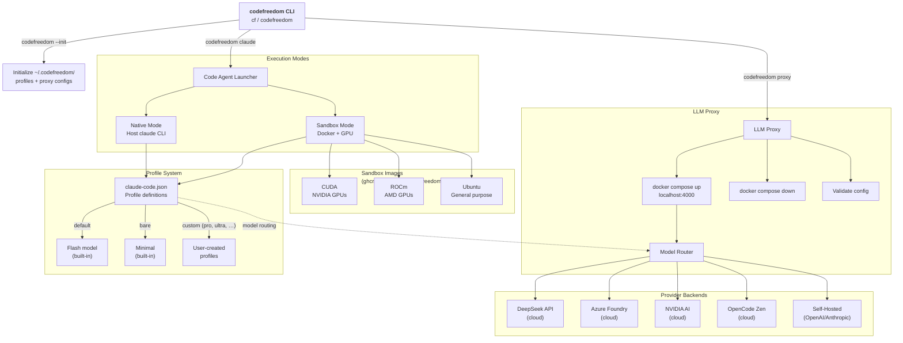
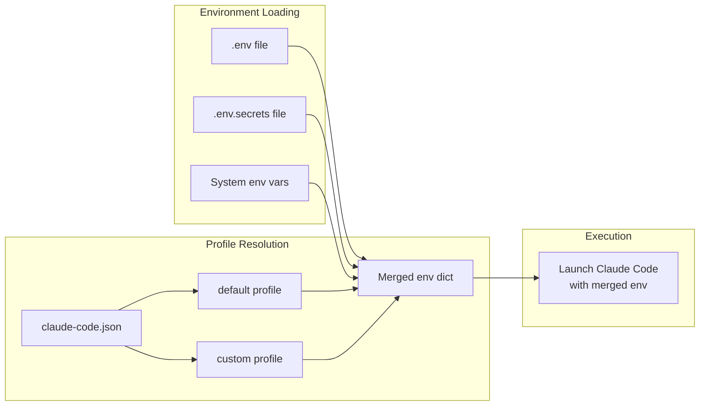
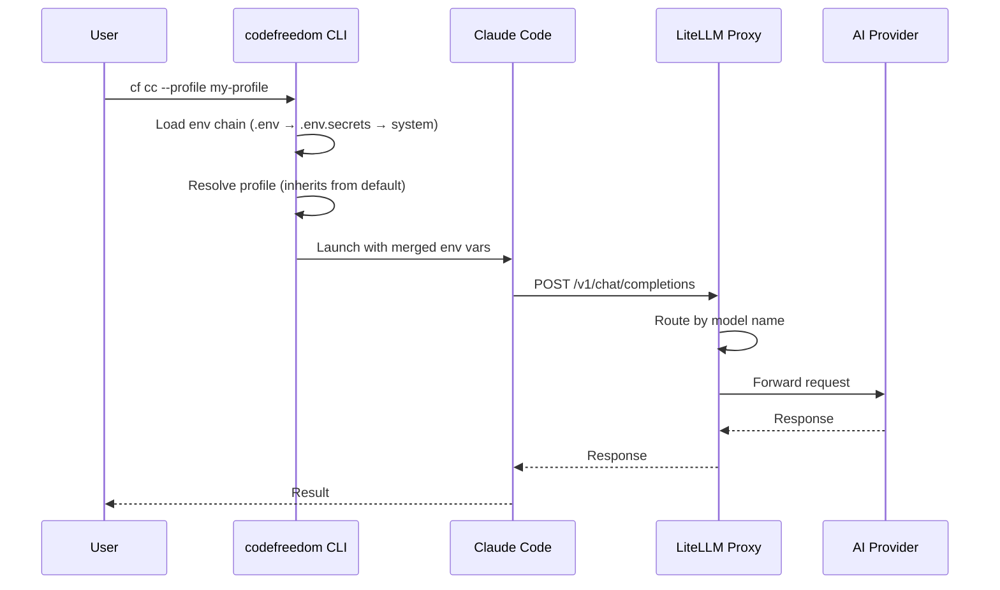

# Architecture

CodeFreedom is a CLI tool that provides a unified interface for code agents with LLM routing, sandboxing, and profile management. All configuration is managed from `~/.codefreedom`.

## Bird's-Eye View



## CLI Design

The CLI uses a subcommand structure:

```
codefreedom / cf
├── --init              # Bootstrap ~/.codefreedom/
├── claude (cc)         # Launch code agent
│   ├── --profile       # Model profile
│   ├── --sandbox       # Docker container
│   ├── --native-models # Bypass proxy
│   ├── --stop          # Stop containers
│   ├── --status        # Container status
│   └── --list-profiles # List profiles
└── proxy (px)          # Manage LLM proxy
    ├── --up            # Start proxy (native)
    ├── --up --docker   # Start via Docker Compose
    ├── --down          # Stop proxy
    ├── --status        # Proxy status
    └── --validate      # Validate config
```

## Configuration Flow



## Data Flow



## Key Design Decisions

| Decision                         | Rationale                                                                    |
| -------------------------------- | ---------------------------------------------------------------------------- |
| **Single config home**           | All configuration lives in `~/.codefreedom` — profiles, proxy, sandbox       |
| **Stateless proxy by default**   | Zero-config startup — no database, no Prisma, no migrations                  |
| **Profile inheritance**          | Custom profiles only need to override what differs from `default`            |
| **Ephemeral sandbox containers** | No container-locking from shared reuse — each session gets a fresh container |
| **Opt-in providers**             | Set an API key to enable; leave empty to disable                             |
| **Docker is optional**           | Proxy runs natively or via Docker Compose; Docker only required for sandbox  |
| **Env chain loading**            | `.env` → `.env.secrets` → system env — later overrides earlier               |
