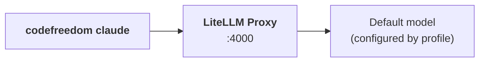

# First run

Three commands, zero configuration needed. You should have Claude Code talking to a model in under five minutes.

## 1. Initialize `~/.codefreedom`

```bash
codefreedom --init
```

This writes the default profile, `.env.claude` / `.env.claude.secrets`, and the proxy configs. **You don't need to edit anything yet** — defaults are wired to a free model.

## 2. Start the proxy

```bash
codefreedom proxy start
```

This pulls and starts the `codefreedom:litellm-latest` image. On first run it also pulls the `codefreedom:web-bridge` image. Wait for the `[OK] Proxy ready at http://localhost:4000` line.

Verify it works:

```bash
codefreedom proxy status
```

## 3. Launch the code agent

```bash
codefreedom claude
```

You're now in Claude Code, routed through the proxy. Try a model switch:

```bash
codefreedom claude --profile ultra    # the strongest model
codefreedom claude --profile air      # the smallest, fastest
codefreedom claude --list-profiles    # see all built-in profiles
```

## What just happened



- `codefreedom --init` wrote `~/.codefreedom/profiles/claude-code.json` and `.env.claude*`.
- `codefreedom proxy start` brought up the proxy via `docker compose`.
- `codefreedom claude` read your profile, set the right env vars, and launched Claude Code pointed at `localhost:4000`.

## Stop the proxy when done

```bash
codefreedom proxy stop
```

The proxy is independent of any `codefreedom claude` session — you can leave it running between sessions or stop it to free resources.

## Next step

You've used the default profile. Now learn how **[profiles](../guides/profiles.md)** work, and try a **[free model](free-models.md)** if you want to explore without spending on API credits.
