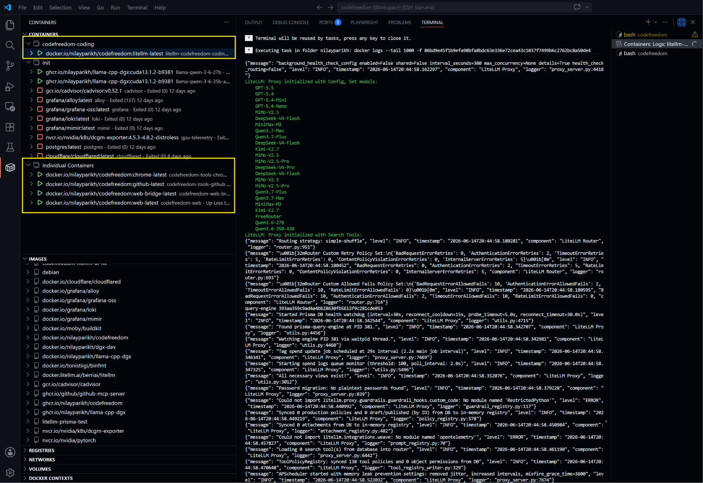

## Prerequisites

- **Python 3.10+** — for the CLI
- **Docker** — for proxy and sandbox containers
- **uv** — Python package manager

Install uv if you don't have it:

```bash
curl -LsSf https://astral.sh/uv/install.sh | sh
```

## Install

```bash
uv tool install codefreedom
```

## Set Up

Run the interactive setup wizard. It will ask which recipe to use and walk you through secrets:

```bash
cf setup init --plan-and-apply costeffective-coding-with-local
```

Or use the short alias:

```bash
cf s i -pa costeffective-coding-with-local
```

## Set Up Secrets

After setup, run the assisted script to configure your API keys:

```bash
bash ~/.codefreedom/scripts/costeffective-coding-with-local/setup-secrets.sh
```

This adds `CF_CLI_*` environment variables to your shell profile:

```text
# >>> codefreedom:costeffective-coding-with-local secrets >>>
export CF_CLI_LITELLM_MASTER_KEY="sk-..."
export CF_CLI_MICROSOFT_FOUNDRY_API_BASE="https://...services.ai.azure.com/openai/v1"
export CF_CLI_MICROSOFT_FOUNDRY_API_KEY="..."
export CF_CLI_OPENCODE_ZEN_API_KEY="..."
export CF_CLI_OPENROUTER_API_KEY="..."
export CF_CLI_GITHUB_PERSONAL_ACCESS_TOKEN="github_pat_..."
export CF_CLI_LOCAL_M_API_KEY="..."
export CF_CLI_LOCAL_S_API_KEY="..."
# <<< codefreedom:costeffective-coding-with-local secrets <<<
```

## Start the Proxy

```bash
cf run proxy start
```

Or with short alias:

```bash
cf r px start
```

<figure markdown="span">
  { width="700" }
  <figcaption>Proxy running at localhost:4000</figcaption>
</figure>

## Launch an Agent

```bash
cf run agent claude-code
```

Or with short alias:

```bash
cf r ag cc
```

<figure markdown="span">
  { width="700" }
  <figcaption>Claude Code connected via proxy</figcaption>
</figure>

## Available Agents

| Agent | Command | Alias |
| --- | --- | --- |
| Claude Code | `cf r ag cc` | `cc` |
| MiMo Code | `cf r ag mc` | `mc` |
| OpenCode | `cf r ag oc` | `oc` |

## Quick Reference

| Command | Short | Description |
| --- | --- | --- |
| `cf setup init` | `cf s i` | Set up config |
| `cf run proxy start` | `cf r px start` | Start the proxy |
| `cf run agent claude-code` | `cf r ag cc` | Launch Claude Code |
| `cf manage doctor` | `cf m dr` | Check system health |
