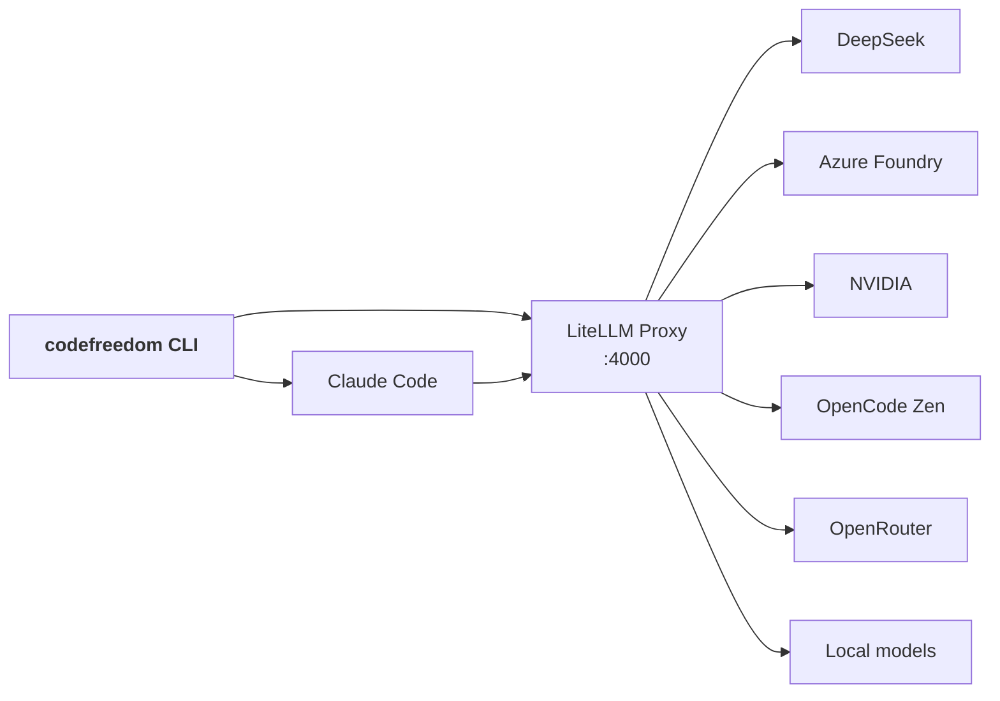

<div class="cf-hero" markdown>

# CodeFreedom

<div class="cf-hero__tagline" markdown>

**One CLI for every code agent.**  
Switch LLM providers, isolate environments, and stop fighting config sprawl — all from `~/.codefreedom`.

</div>

<div class="cf-hero__install" markdown>

```bash
pip install codefreedom
```

</div>

<div class="cf-hero__buttons" markdown>
[:material-rocket-launch: Get started](getting-started/install.md){ .md-button .md-button--primary }
[:material-book-open-variant: Reference](reference/index.md){ .md-button }
[:material-github: GitHub](https://github.com/nilayparikh/codefreedom){ .md-button }
</div>

</div>

## Why CodeFreedom

<div class="grid cards" markdown>

- :material-swap-horizontal:{ .lg .middle } **Switch models, not configs**

  ***

  DeepSeek for drafting, Azure for reasoning, OpenCode Zen for free-tier exploration. Same CLI, different profile. No agent code changes.

  [:octicons-arrow-right-24: Profile system](guides/profiles.md)

- :material-shield-check:{ .lg .middle } **Isolated, reproducible sandboxes**

  ***

  CUDA, ROCm, or plain Ubuntu Docker images. Every session gets a fresh ephemeral container — no state leaks between runs.

  [:octicons-arrow-right-24: Sandbox mode](guides/sandbox.md)

- :material-graph-outline:{ .lg .middle } **Self-hosted proxy**

  ***

  LiteLLM at `http://localhost:4000`. Provider failover, spend tracking, model aliases — all opt-in.

  [:octicons-arrow-right-24: Proxy setup](reference/proxy/index.md)

- :material-toolbox-outline:{ .lg .middle } **Browser tools that just work**

  ***

  Headless Chrome via CDP for automation. Stealth Camoufox for anti-bot sites. Lifecycle managed automatically per session.

  [:octicons-arrow-right-24: Browser tools](guides/tools/index.md)

</div>

## Quick start

=== "Linux / macOS"

    ```bash
    pip install codefreedom
    codefreedom --init
    codefreedom proxy start
    codefreedom claude
    ```

=== "Windows"

    ```powershell
    py -3 -m pip install codefreedom
    py -3 -m codefreedom --init
    py -3 -m codefreedom proxy start
    py -3 -m codefreedom claude
    ```

=== "From source"

    ```bash
    git clone https://github.com/nilayparikh/codefreedom.git
    cd codefreedom
    pip install -e ".[all]"
    codefreedom --init
    codefreedom proxy start
    codefreedom claude
    ```

## Architecture at a glance

CodeFreedom orchestrates code agents through their **publicly supported interfaces only** — environment variables, CLI flags, and API endpoints. No patching, no reverse-engineering.



## Prerequisites

| What         | Required For                                 | How to Check                                          |
| ------------ | -------------------------------------------- | ----------------------------------------------------- |
| Python 3.10+ | CLI                                          | `python3 --version`                                   |
| Docker       | Sandbox + proxy (hard prerequisite for both) | [docker.com](https://docs.docker.com/engine/install/) |
| Node.js      | Local Claude Code                            | `npm install -g @anthropic-ai/claude-code`            |

> **Docker is required for the proxy.** The proxy always runs via `docker compose` against the self-hosted `codefreedom:litellm-latest` image — no host-side `litellm` install is needed.

## What's next?

<div class="grid cards" markdown>

- :material-cog-outline:{ .lg .middle } **Configuration**

  ***

  The full `.env` chain, profile inheritance, and `${VAR}` interpolation.

  [:octicons-arrow-right-24: Environment](reference/environment.md)

- :material-graph-outline:{ .lg .middle } **Architecture**

  ***

  How the CLI, profiles, sandbox, and proxy fit together.

  [:octicons-arrow-right-24: Architecture](reference/architecture.md)

- :material-help-circle-outline:{ .lg .middle } **Troubleshooting**

  ***

  Common issues, Docker quirks, and proxy debugging.

  [:octicons-arrow-right-24: Troubleshooting](reference/troubleshooting.md)

- :material-scale-balance:{ .lg .middle } **License**

  ***

  Apache 2.0 — see the NOTICE file for attributions.

  [:octicons-arrow-right-24: License](reference/license.md)

</div>
