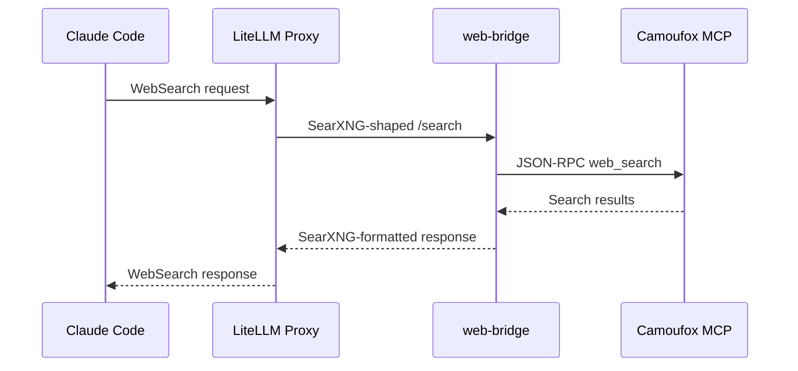

# WebSearch Interception

CodeFreedom transparently replaces Claude Code's native `WebSearch` with a local, privacy-friendly alternative powered by a stealth browser.

## How It Works

### Flow

1. Claude Code issues a `WebSearch` request
2. The LiteLLM proxy intercepts it via the `websearch_interception` callback
3. The request is routed to the `web-bridge` sidecar service
4. The bridge translates the SearXNG-shaped request into a JSON-RPC call
5. The Camoufox MCP `web_search` tool executes the search using a stealth browser
6. Results flow back through the same chain

### Why This Matters

- **Privacy:** Searches go through your local browser, not external APIs
- **Reliability:** Works even when Claude Code's native WebSearch is unavailable
- **Stealth:** Camoufox provides anti-detection browsing

## Prerequisites

- Proxy must be running (`cf run proxy start`)
- The `web-bridge` and Camoufox containers must be active (auto-started with proxy)

## Limitations

- Search speed depends on Camoufox response time
- Some search engines may block automated queries
- Results are limited to what the stealth browser can access

## Troubleshooting

If WebSearch isn't working:

1. Run `cf manage doctor` to check proxy and tool status
2. Verify the web-bridge container is running: `docker ps | grep web-bridge`
3. Check proxy logs: `docker logs codefreedom-litellm`

See [Troubleshooting Guide](../guides/troubleshooting.md) for more.
