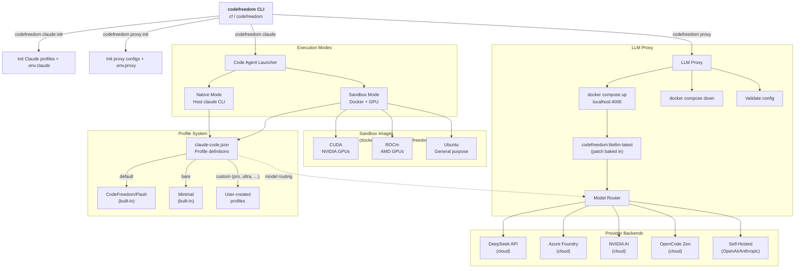
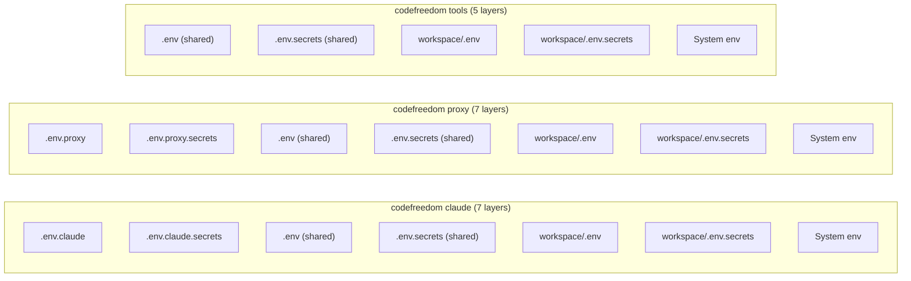
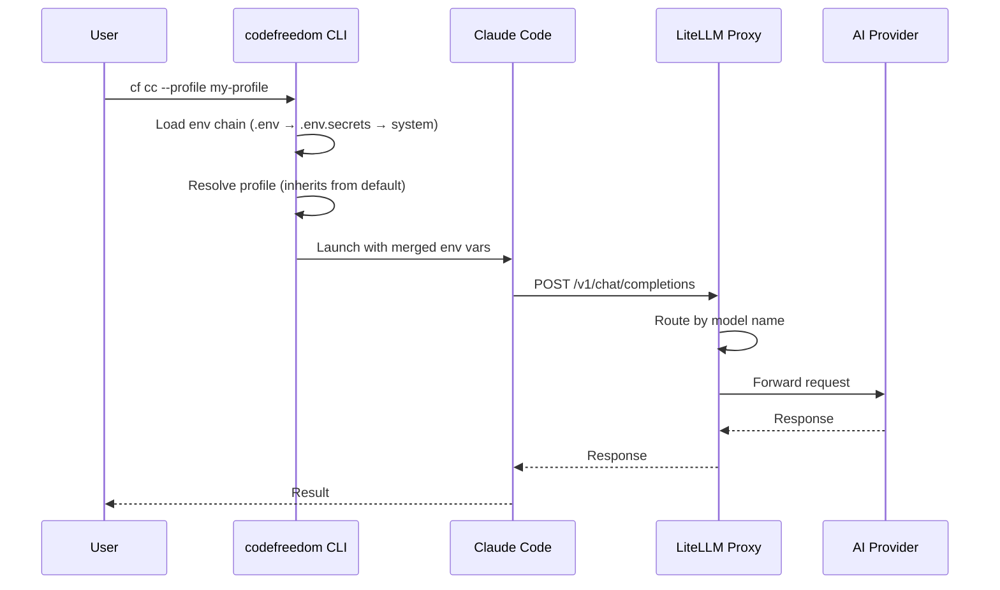
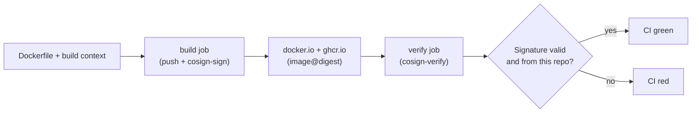

# Architecture

CodeFreedom is a CLI tool that provides a unified interface for code agents with LLM routing, sandboxing, and profile management. All configuration is managed from `~/.codefreedom`.

## Bird's-Eye View



## CLI Design

The CLI uses a subcommand structure:

```
codefreedom / cf
├── claude (cc)         # Launch code agent
│   ├── init            # Initialize Claude profiles + .env.claude (clean target only)
│   ├── --profile       # Model profile
│   ├── --sandbox       # Docker container
│   ├── --native-models # Bypass proxy
│   ├── --stop          # Stop containers
│   ├── --status        # Container status
│   └── --list-profiles # List profiles
├── proxy (px)          # Manage LLM proxy
│   ├── init            # Initialize proxy configs + .env.proxy (clean target only)
│   ├── start           # Start proxy (Docker Compose, default)
│   ├── stop            # Stop proxy
│   ├── restart         # Restart proxy (preserves state, no image pull)
│   ├── status          # Proxy status
│   └── validate        # Validate config
└── tools               # Manage auxiliary tools
    ├── chrome          # Chrome browser (Xvfb + CDP)
    │   └── init|start|stop|status|url
    └── web             # Web search tool (MCP)
        └── init|start|stop|status
```

## Configuration Flow

Each component loads its own subset of the env chain — they do not share component-specific files.



See [Environment Configuration](environment.md) for the full precedence chain and variable interpolation details.

## Data Flow



## Image Supply Chain

Every published container image goes through a build → sign → verify pipeline before consumers can `docker pull` it.



### Composite Actions

The pattern is captured in two reusable composite actions so adding a new image family is a copy-paste of any `docker-*.yml` workflow:

- **`.github/actions/cosign-sign`** — `cosign sign --yes <image@digest>`. Caller logs in first.
- **`.github/actions/cosign-verify`** — `cosign verify` against the GitHub OIDC issuer and the repo identity regexp. Caller logs in first.

Both install cosign v2.4.1 via the official `sigstore/cosign-installer@v3`. No long-lived private key — the workflow run is the signer.

### Why a separate verify job

Splitting sign (in `build`) from verify (in `needs: build`) means a compromised image can't pass CI: a successful verify proves the published digest is reachable and the signature is valid against the repo's OIDC identity. A bad push fails verify, even though build/push/sign all succeeded.

### Consumer verification

```bash
cosign verify \
  --certificate-identity-regexp 'https://github.com/nilayparikh/codefreedom' \
  --certificate-oidc-issuer 'https://token.actions.githubusercontent.com' \
  ghcr.io/nilayparikh/codefreedom:cuda-latest
```

## Key Design Decisions

| Decision                         | Rationale                                                                                                                                                                                 |
| -------------------------------- | ----------------------------------------------------------------------------------------------------------------------------------------------------------------------------------------- |
| **Single config home**           | All configuration lives in `~/.codefreedom` — profiles, proxy, sandbox                                                                                                                    |
| **Stateless proxy by default**   | Zero-config startup — no database, no Prisma, no migrations                                                                                                                               |
| **Profile inheritance**          | Custom profiles only need to override what differs from `default`                                                                                                                         |
| **Ephemeral sandbox containers** | No container-locking from shared reuse — each session gets a fresh container                                                                                                              |
| **Opt-in providers**             | Set an API key to enable; leave empty to disable                                                                                                                                          |
| **Proxy is Docker-only**         | The proxy always runs via `docker compose` against the self-hosted `codefreedom:litellm-latest` image (with the WebSearch count patch baked in). No host-side `litellm` install required. |
| **Env chain loading**            | `.env` → `.env.secrets` → system env — later overrides earlier                                                                                                                            |

## See Also

- [Proxy Overview](proxy/index.md) — provider list with per-model links
- [Providers](proxy/providers/index.md) — full provider configuration reference
- [Proxy Configuration](proxy/config.md) — model aliases, retry policy, fallbacks
- [Profiles](../guides/profiles.md) — Claude Code profile schema and inheritance
- [Code Agents](../guides/agents.md) — local vs sandbox mode
- [Browser Tools](../guides/tools/index.md) — Chrome and web tool profiles
