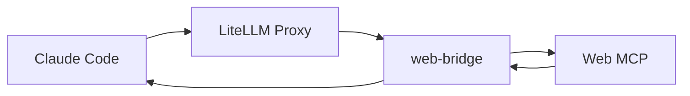

# FAQ: Web Search

## The Problem

Claude Code ships with built-in `WebSearch` and `WebFetch` tools. In practice:

- **`WebFetch`** works in most setups (fetches page content).
- **`WebSearch`** often **does not work** — it requires Anthropic's internal login/credentials and will fail or return empty results for most users.

You end up with a tool that Claude tries to use, but silently fails or hangs.

## The Recommended Solution: Proxy Interception

If you're running Claude Code through the CodeFreedom proxy, the **recommended** approach is to enable the [Web Search Interception](../proxy/websearch-interception.md) pipeline. The proxy transparently replaces Claude Code's `WebSearch` with calls to the local web tool MCP `web_search` tool. No `CLAUDE.md` instructions, no per-host configuration — it just works for any model behind the proxy.



See the full guide: [Web Search Interception](../proxy/websearch-interception.md).

## Fallback: MCP + CLAUDE.md

If you're **not** using the proxy (e.g., `codefreedom claude --native-models`), or the bridge is down, you can fall back to the per-host MCP approach described below. This is the older approach and is kept as a fallback.

### How It Works (fallback)

1. **`~/.claude/settings.json`** registers the MCP server so Claude Code discovers `web_search` and `web_fetch` as available tools.
2. **`~/.claude/CLAUDE.md`** (or a project-level `CLAUDE.md`) instructs Claude to prefer MCP tools over native ones.
3. When Claude attempts `WebSearch`, the instructions guide it to use `web__web_search` instead.

### Why This Is a Fallback, Not the Default

- **Not transparent** — every new host needs the `settings.json` and `CLAUDE.md` snippet.
- **Only works for Anthropic-native models** — non-Anthropic models behind a proxy without interception still get the broken native `WebSearch`.
- **Harder to disable** — toggling it off means editing two files on every host.

Use it only when the proxy path isn't available.

## Why Common "Fixes" Don't Work

### Shell-script hooks (PreToolUse)

You may find suggestions to intercept tool calls with shell scripts that parse JSON via `grep`/`sed` and reject native tools. This approach has fundamental flaws:

| Issue                | Why it matters                                                            |
| -------------------- | ------------------------------------------------------------------------- |
| Fragile JSON parsing | `grep -o '"tool"'` breaks on escaped quotes, newlines, multi-line strings |
| Latency              | Spawns a subprocess on **every** tool call just to reject it              |
| No fallback          | If the MCP container isn't running, the hook still blocks native tools    |
| Manual setup         | `chmod +x`, edit `settings.json` by hand — different on every machine     |
| No validation        | Doesn't check if the MCP server is actually reachable                     |

### Disabling tools via CLI flags

Claude Code has no public flag to disable built-in tools. Workarounds rely on internal behavior that can change without notice.

---

## Step 1: Start the Web MCP Container

CodeFreedom ships a web container with a built-in MCP server:

```bash
# Initialize the tool profile (one-time, requires acceptance)
codefreedom tools web init

# Start the container
codefreedom tools web start

# Verify it's running
codefreedom tools web status
```

This starts an MCP server at `http://127.0.0.1:8420/mcp` exposing two tools:

| Tool                | Description                                               |
| ------------------- | --------------------------------------------------------- |
| `web_search(query)` | Search via configured engines, returns structured results |
| `web_fetch(url)`    | Fetch a webpage (bypasses anti-bot detection)             |

See [Web Tool](../../guides/tools/web.md) for container configuration, search engine setup, and parser registry details.

---

## Step 2: Register the MCP Server

Add the MCP server to Claude Code's `settings.json`:

```bash
# Determine the correct path
# Local mode:  ~/.claude/settings.json
# Sandbox mode: ~/.codefreedom/sandbox/<profile>/.claude/settings.json
```

### Local Mode

Edit (or create) `~/.claude/settings.json`:

```json
{
  "mcpServers": {
    "web": {
      "url": "http://127.0.0.1:8420/mcp"
    }
  }
}
```

If the file already has other keys, merge the `mcpServers` block — don't overwrite existing content.

### Sandbox Mode

Inside a sandbox, Claude Code runs in an isolated filesystem. The settings path is:

```
~/.codefreedom/sandbox/<profile>/.claude/settings.json
```

For the default profile:

```
~/.codefreedom/sandbox/default/.claude/settings.json
```

Create the directory and file:

```bash
mkdir -p ~/.codefreedom/sandbox/default/.claude
cat > ~/.codefreedom/sandbox/default/.claude/settings.json << 'EOF'
{
  "mcpServers": {
    "web": {
      "url": "http://127.0.0.1:8420/mcp"
    }
  }
}
EOF
```

> **Note:** The sandbox container mounts this directory as its `.claude` home. The MCP container runs on the host, so `127.0.0.1` resolves correctly from inside the sandbox (Docker default network).

---

## Step 3: Add Custom Instructions

Claude Code reads `CLAUDE.md` files for context. Add instructions to prefer MCP tools.

### Global (all projects)

Append to `~/.claude/CLAUDE.md`:

```markdown
## Web Tool Configuration

This environment has a web MCP server exposing `web_search` and `web_fetch` tools.

- When asked to search the web, use `web__web_search` with the `query` parameter.
- When asked to fetch a webpage, use `web__web_fetch` with the `url` parameter.
- Do NOT use native WebSearch or WebFetch tools. They are not available in this environment.
```

### Project-level (single project)

Append to your project's `CLAUDE.md`:

```markdown
## Web Search

Use the MCP tools `web__web_search` and `web__web_fetch` for all web operations.
Native WebSearch/WebFetch are not available.
```

---

## Step 4: Verify

Start Claude Code and test:

```bash
codefreedom claude
```

Ask Claude to search for something. It should use `web__web_search` instead of `WebSearch`.

You can verify the MCP connection is working:

```bash
curl -s http://127.0.0.1:8420/mcp | head -c 200
```

A reachable server returns a response (even if it's an error for an empty request).

---

## Alternative MCP Servers

CodeFreedom's web container is one option. Other MCP servers that expose `web_search`/`web_fetch`:

### Trivilli / Jina MCP

[Jina AI](https://jina.ai) offers a search API with an MCP wrapper:

```json
{
  "mcpServers": {
    "jina": {
      "url": "https://mcp.jina.ai/mcp"
    }
  }
}
```

Requires a Jina API key (free tier available).

### Brave Search MCP

```json
{
  "mcpServers": {
    "brave": {
      "url": "http://localhost:3040/mcp"
    }
  }
}
```

Requires running the Brave Search MCP server locally with a Brave API key.

### Why CodeFreedom's Container is Preferred

| Feature              | CodeFreedom web              | External MCP                      |
| -------------------- | ---------------------------- | --------------------------------- |
| Self-hosted          | Yes, runs on your machine    | Depends on third-party API        |
| Anti-bot evasion     | Stealth browser              | Standard HTTP requests            |
| Search engine config | User-configured via profile  | Fixed by provider                 |
| Cost                 | Free (your own hardware)     | API key required, may have limits |
| Privacy              | Queries stay on your machine | Queries go to third-party         |

---

## Troubleshooting

### "web\_\_web_search is not available"

1. Check the container is running: `codefreedom tools web status`
2. Check the MCP endpoint: `curl -s http://127.0.0.1:8420/mcp`
3. Verify `settings.json` has the correct port (matches your `web.json` profile):
   ```bash
   cat ~/.claude/settings.json
   ```

### "Claude still uses WebSearch"

1. Make sure `CLAUDE.md` has the custom instructions (Step 3 above).
2. The instructions must mention `web__web_search` (the full namespaced tool name).
3. Start a **new** Claude Code session — instructions are loaded at session start.

### Sandbox: "Connection refused"

The web tool container runs on the **host**. From inside the sandbox:

1. Make sure both containers share the default Docker network:
   ```bash
   docker network ls
   # Both containers should be on the "bridge" network or a shared custom network
   ```
2. If you use a custom network, connect both containers:
   ```bash
   docker network connect <network> codefreedom-web
   docker network connect <network> codefreedom-<sandbox-id>
   ```
3. Alternatively, use the host's IP instead of `127.0.0.1`:
   ```json
   {
     "mcpServers": {
       "web": {
         "url": "http://host.docker.internal:8420/mcp"
       }
     }
   }
   ```

### Port conflicts

If port 8420 is in use, change it in the web profile:

```bash
# Edit ~/.codefreedom/profiles/web.json
# Change "port": 8420 to "port": 8421
# Then update settings.json to match
```

---

## Path Reference

| Mode    | settings.json                                            | CLAUDE.md                                            |
| ------- | -------------------------------------------------------- | ---------------------------------------------------- |
| Local   | `~/.claude/settings.json`                                | `~/.claude/CLAUDE.md` or project `CLAUDE.md`         |
| Sandbox | `~/.codefreedom/sandbox/<profile>/.claude/settings.json` | `~/.codefreedom/sandbox/<profile>/.claude/CLAUDE.md` |
