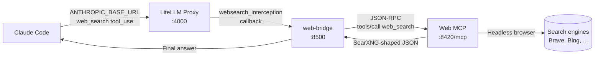

# Web Search Interception

The CodeFreedom proxy can transparently replace Claude Code's built-in `WebSearch` tool with calls to the local web tool's MCP `web_search`. No `CLAUDE.md` instructions, no `~/.claude/settings.json` edits, no per-host configuration.

This is the recommended setup. The legacy workaround (MCP server registration + `CLAUDE.md` prompt) is preserved in the [Web Search FAQ](../faq/web-search.md) as a fallback.

## Why

Claude Code's `WebSearch` requires Anthropic's internal login/credentials. For most users it silently fails or returns empty results. By intercepting the call on the proxy and routing it to a local web tool browser, the search works for **any model** connected to the proxy — not just Anthropic-native models.

## Architecture



The proxy intercepts the native `web_search` tool, calls the bridge (a SearXNG-shaped HTTP front), which in turn calls the existing web tool MCP `web_search` tool. From Claude Code's perspective `WebSearch` "just works".

## Prerequisites

| Requirement                                                                 | Why                                                               |
| --------------------------------------------------------------------------- | ----------------------------------------------------------------- |
| `codefreedom tools web start` running                                       | Provides the MCP `web_search` tool at `http://127.0.0.1:8420/mcp` |
| `codefreedom proxy start` working                                           | The proxy and bridge are sibling services in the compose stack    |
| A model behind the proxy (Anthropic, OpenAI-compat, Bedrock, Vertex, Azure) | Any of them can now use the bridge for `WebSearch`                |

## Quick Start (4 steps)

### 1. Start the web tool MCP container

```bash
codefreedom tools web start
codefreedom tools web status   # confirm 'running'
```

### 2. Start the proxy (which also starts the bridge)

The bridge is a sibling service in the existing `docker-compose.yaml`. No new commands:

```bash
codefreedom proxy start
docker ps --filter "name=codefreedom-web-bridge"   # confirm it's up
```

### 3. Enable interception in `~/.codefreedom/proxy/config/config.yaml`

Uncomment two blocks:

```yaml
litellm_settings:
  callbacks:
    - prometheus
    - websearch_interception # ← uncomment

  websearch_interception_params: # ← uncomment
    enabled_providers: ["openai", "anthropic", "vertex_ai", "bedrock", "azure"]
    search_tool_name: codefreedom-web

search_tools: # ← uncomment
  - search_tool_name: codefreedom-web
    litellm_params:
      search_provider: searxng
      api_base: http://web-bridge:8500 # compose service name
```

### 4. Restart the proxy and test

```bash
codefreedom proxy restart
codefreedom claude
```

Ask Claude "what's the latest FastAPI release?" — the proxy logs will show `websearch_interception` triggered, and the answer will come from the local web tool browser.

## Configuration Reference

### Environment variables (`~/.codefreedom/.env.proxy`)

| Variable                      | Default                                | Purpose                                                                                                                                                                                                                                                                                                               |
| ----------------------------- | -------------------------------------- | --------------------------------------------------------------------------------------------------------------------------------------------------------------------------------------------------------------------------------------------------------------------------------------------------------------------- |
| `WEB_BRIDGE_CONTAINER_NAME`   | `codefreedom-web-bridge`               | Docker container name                                                                                                                                                                                                                                                                                                 |
| `MCP_WEB_URL`                 | `http://host.docker.internal:8420/mcp` | Where the bridge finds the web tool MCP                                                                                                                                                                                                                                                                               |
| `WEB_BRIDGE_COOLDOWN_SECONDS` | `2.0`                                  | Per-bridge cooldown. Rapid `/search` calls within this window return HTTP 429.                                                                                                                                                                                                                                        |
| `MCP_TIMEOUT_SECONDS`         | `60`                                   | Per-call MCP HTTP timeout. Should be larger than the MCP's own 10s default cooldown plus browser-render time.                                                                                                                                                                                                         |
| `SEARXNG_API_BASE`            | `http://web-bridge:8500`               | **Required**. Set in `docker-compose.yaml` (litellm service). Tells LiteLLM's SearXNG provider where to find the web-bridge. The `search_tools` block in `config.yaml` also sets this via `litellm_params.api_base`, but LiteLLM's handler doesn't pass it through — the env var is the fallback that actually works. |

> **Why a 2-second cooldown on top of the MCP's 10s?** The MCP's 10s cooldown is enforced _inside_ the browser process (so a second call still wastes a render). The bridge's 2s cooldown rejects rapid callers _before_ the MCP even starts, protecting both the browser and downstream callers.

### `websearch_interception_params` block

| Field               | Purpose                                                                                                                                                                                                                                          |
| ------------------- | ------------------------------------------------------------------------------------------------------------------------------------------------------------------------------------------------------------------------------------------------ |
| `enabled_providers` | List of LiteLLM provider names that should have their native `web_search` intercepted. `anthropic` covers direct Anthropic, `openai` covers the OpenAI translation path, `bedrock` / `vertex_ai` / `azure` cover the cloud-provider equivalents. |
| `search_tool_name`  | Must match the `search_tool_name` in the `search_tools` block below.                                                                                                                                                                             |

### `search_tools` block

| Field                      | Purpose                                                                                                                                                                    |
| -------------------------- | -------------------------------------------------------------------------------------------------------------------------------------------------------------------------- |
| `search_tool_name`         | Internal name; can be anything unique.                                                                                                                                     |
| `search_provider: searxng` | Tells LiteLLM the bridge speaks SearXNG's JSON API.                                                                                                                        |
| `api_base`                 | URL the proxy hits when intercepting. Use the compose service name `http://web-bridge:8500` so the bridge is reachable on the shared network without exposing a host port. |

## Disabling

To temporarily turn off interception (and let the native `WebSearch` flow through unchanged):

```bash
# Comment out the two blocks in config.yaml
codefreedom proxy restart --docker
```

To remove the bridge entirely from the stack, delete the `web-bridge:` service from `~/.codefreedom/proxy/docker-compose.yaml` and re-run `codefreedom proxy restart --docker`.

## Troubleshooting

| Symptom                                                     | Likely cause                                                                                                                                            | Fix                                                                                                                                                                                                 |
| ----------------------------------------------------------- | ------------------------------------------------------------------------------------------------------------------------------------------------------- | --------------------------------------------------------------------------------------------------------------------------------------------------------------------------------------------------- |
| Proxy logs show `websearch_interception` not triggered      | The two config blocks are not both uncommented, or the model is not in `enabled_providers`                                                              | Re-check `config.yaml`; add the provider to `enabled_providers`                                                                                                                                     |
| Bridge container restart-loops                              | Web tool MCP not running                                                                                                                                | `codefreedom tools web start`                                                                                                                                                                       |
| `/search` returns HTTP 502 `mcp_unreachable`                | Bridge can't reach `MCP_WEB_URL`                                                                                                                        | Check `MCP_WEB_URL`; on Linux Docker, the `host.docker.internal:host-gateway` extra_hosts mapping must be present (it is, in the example compose)                                                   |
| `/search` returns HTTP 429 `cooldown`                       | The 2-second bridge cooldown is active. Normal — Claude Code will retry.                                                                                | If too aggressive, raise `WEB_BRIDGE_COOLDOWN_SECONDS` in `.env.proxy` and restart the proxy                                                                                                        |
| Claude Code says "WebSearch is not available"               | The interception is disabled in `config.yaml`                                                                                                           | Re-enable the `websearch_interception` callback                                                                                                                                                     |
| Native Claude Code (`--native-models`) still doesn't search | The bridge is proxy-only; direct Anthropic calls bypass it                                                                                              | Either switch to the proxy (`codefreedom claude` without `--native-models`) or fall back to the [MCP approach in the FAQ](../faq/web-search.md)                                                     |
| Proxy logs show `SEARXNG_API_BASE is not set`               | The SearXNG provider requires this env var (LiteLLM's handler doesn't pass `api_base` from `litellm_params`)                                            | Set `SEARXNG_API_BASE=http://web-bridge:8500` in `docker-compose.yaml` (litellm service env). Must `docker compose down && up -d` (not `restart`) to pick up new vars.                              |
| Search works but Claude Code shows "Did 0 searches"         | LiteLLM's short-circuit handler omits `usage.server_tool_use.web_search_requests` from the response. Claude Code's TUI uses this field for the counter. | The patch is baked into the `codefreedom:litellm-latest` image at build time (see `docker/litellm/patch_websearch_count.py`). Pull the latest image and `docker compose pull && up -d` to activate. |

## Healthcheck

The bridge exposes a simple liveness probe:

```bash
docker exec codefreedom-web-bridge wget -qO- http://localhost:8500/healthz
# {"status": "ok"}
```

Use this in your own monitoring or compose healthcheck if you want stricter reliability.

## Related

- [Web Search FAQ](../faq/web-search.md) — the legacy MCP + `CLAUDE.md` approach (fallback for non-proxy users)
- [LiteLLM websearch_interception docs](https://docs.litellm.ai/docs/tutorials/claude_code_websearch) — the underlying LiteLLM feature
