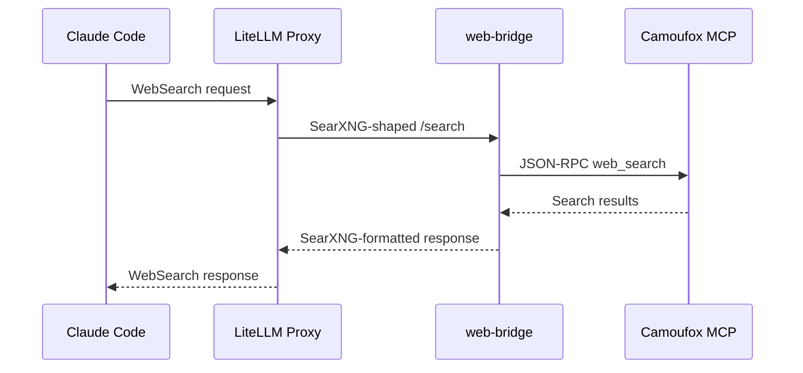

# CodeFreedom 0.1.9 Implementation Plan

> **For agentic workers:** REQUIRED SUB-SKILL: Use superpowers:subagent-driven-development (recommended) or superpowers:executing-plans to implement this plan task-by-task. Steps use checkbox (`- [ ]`) syntax for tracking.

**Goal:** Improve CodeFreedom 0.1.9 in reliability, maintainability, and product completeness without changing core workflows.

**Architecture:** Tests first (Phase 1), then docs (Phase 2), then architecture refactors (Phase 3-4), then diagnostics (Phase 5), then housekeeping (Phase 6). Single PR with logical commit groups.

**Tech Stack:** Python 3.10+, pytest, ruff, mypy, MkDocs Material, Docker

**Spec:** `docs/superpowers/specs/2026-06-13-codefreedom-0-1-9-design.md`

---

## File Structure Summary

### Files to Create

| Path | Purpose |
|------|---------|
| `tests/test_launcher.py` | Launcher flow tests |
| `tests/test_sandbox_launcher.py` | Sandbox launcher tests |
| `tests/test_agent_dispatch.py` | Agent dispatch tests |
| `tests/test_claude.py` | Claude entrypoint tests |
| `tests/test_opencode.py` | OpenCode entrypoint tests |
| `docs/proxy/websearch-interception.md` | WebSearch interception docs |
| `docs/features/mimo-code.md` | MiMoCode feature docs |
| `docs/guides/recipes-guide.md` | Recipe sourcing guide |
| `docs/guides/troubleshooting.md` | Troubleshooting guide |
| `docs/guides/faq.md` | FAQ page |

### Files to Modify

| Path | Purpose |
|------|---------|
| `pyproject.toml` | Add pytest-cov, bump version |
| `tests/test_mimo.py` | Expand MiMo entrypoint tests |
| `src/codefreedom/cli/run/tools.py` | Thin CLI tool layer |
| `src/codefreedom/tools/registry.py` | Consolidate lifecycle ownership |
| `src/codefreedom/cli/run/agent.py` | Explicit agent registry, shared validation |
| `src/codefreedom/cli/manage/doctor.py` | Expand diagnostic checks |
| `mkdocs.yml` | Add Guides section, new pages |
| `docs/index.md` | Update homepage |
| `docs/getting-started/index.md` | Route to new pages |
| `docs/getting-started/first-run.md` | Route to new pages |
| `docs/features/proxy.md` | Cross-link WebSearch page |
| `docs/recipes/index.md` | Clarify recipe sourcing |
| `recipes/README.md` | Clarify recipe sourcing |
| `README.md` | Update product story |
| `ARCHITECTURE.md` | Full inventory update |
| `CHANGELOG.md` | Add 0.1.9 entries |
| `.github/workflows/gated-checkin.yml` | Add coverage step |

---

## Phase 1 — WS2: Reliability & Test Coverage

### Task 1: Add launcher tests

**Files:**
- Create: `tests/test_launcher.py`

- [ ] **Step 1: Create test file with imports and fixtures**

```python
"""Tests for codefreedom.launcher module."""

from __future__ import annotations

import json
from pathlib import Path
from unittest.mock import MagicMock, patch

import pytest


@pytest.fixture()
def workspace_dir(tmp_path: Path) -> Path:
    ws = tmp_path / "workspace"
    ws.mkdir()
    return ws
```

- [ ] **Step 2: Add test for `_generate_container_name`**

```python
class TestGenerateContainerName:
    def test_returns_codefreedom_prefix(self):
        from codefreedom.launcher import _generate_container_name

        name = _generate_container_name()
        assert name.startswith("codefreedom-")

    def test_suffix_is_four_hex_chars(self):
        from codefreedom.launcher import _generate_container_name

        name = _generate_container_name()
        suffix = name.removeprefix("codefreedom-")
        assert len(suffix) == 4
        int(suffix, 16)  # should not raise

    def test_names_are_unique(self):
        from codefreedom.launcher import _generate_container_name

        names = {_generate_container_name() for _ in range(50)}
        assert len(names) == 50
```

- [ ] **Step 3: Add test for `find_claude_binary`**

```python
class TestFindClaudeBinary:
    @patch("shutil.which", return_value="/usr/local/bin/claude")
    def test_returns_path_when_found(self, mock_which):
        from codefreedom.launcher import find_claude_binary

        result = find_claude_binary()
        assert result == "/usr/local/bin/claude"
        mock_which.assert_called_once_with("claude")

    @patch("shutil.which", return_value=None)
    def test_returns_none_when_not_found(self, mock_which):
        from codefreedom.launcher import find_claude_binary

        result = find_claude_binary()
        assert result is None
```

- [ ] **Step 4: Add test for `_write_mcp_json`**

```python
class TestWriteMcpJson:
    def test_creates_mcp_json(self, workspace_dir: Path):
        from codefreedom.launcher import _write_mcp_json

        with patch("codefreedom.launcher.load_tool_mcp_endpoints") as mock_load:
            mock_load.return_value = {
                "mcpServers": {
                    "chrome-devtools": {"type": "http", "url": "http://127.0.0.1:9223/mcp"}
                }
            }
            _write_mcp_json(workspace_dir, ["chrome"])

        mcp_path = workspace_dir / ".mcp.json"
        assert mcp_path.exists()
        data = json.loads(mcp_path.read_text())
        assert "chrome-devtools" in data["mcpServers"]

    def test_preserves_existing_servers(self, workspace_dir: Path):
        from codefreedom.launcher import _write_mcp_json

        mcp_path = workspace_dir / ".mcp.json"
        mcp_path.write_text(json.dumps({
            "mcpServers": {"existing": {"type": "http", "url": "http://localhost:9999"}}
        }))

        with patch("codefreedom.launcher.load_tool_mcp_endpoints") as mock_load:
            mock_load.return_value = {
                "mcpServers": {
                    "chrome-devtools": {"type": "http", "url": "http://127.0.0.1:9223/mcp"}
                }
            }
            _write_mcp_json(workspace_dir, ["chrome"])

        data = json.loads(mcp_path.read_text())
        assert "existing" in data["mcpServers"]
        assert "chrome-devtools" in data["mcpServers"]

    def test_noop_when_no_endpoints(self, workspace_dir: Path):
        from codefreedom.launcher import _write_mcp_json

        with patch("codefreedom.launcher.load_tool_mcp_endpoints") as mock_load:
            mock_load.return_value = {"mcpServers": {}}
            _write_mcp_json(workspace_dir, [])

        mcp_path = workspace_dir / ".mcp.json"
        assert not mcp_path.exists()
```

- [ ] **Step 5: Add test for `ensure_codefreedom_dir`**

```python
class TestEnsureCodefreedomDir:
    def test_creates_sandbox_dirs(self):
        from codefreedom.launcher import ensure_codefreedom_dir

        claude_dir, claude_json = ensure_codefreedom_dir("test-profile")
        assert claude_dir.exists()
        assert claude_json.exists()
        assert json.loads(claude_json.read_text()) == {}

    def test_reuses_existing_json(self):
        from codefreedom.launcher import ensure_codefreedom_dir

        _, claude_json = ensure_codefreedom_dir("test-profile")
        claude_json.write_text('{"key": "value"}')

        _, claude_json2 = ensure_codefreedom_dir("test-profile")
        data = json.loads(claude_json2.read_text())
        assert data == {"key": "value"}
```

- [ ] **Step 6: Add tests for `run_local`**

```python
class TestRunLocal:
    @patch("codefreedom.launcher.find_claude_binary", return_value=None)
    def test_returns_1_when_binary_not_found(self, _mock):
        from codefreedom.launcher import run_local

        result = run_local({}, [])
        assert result == 1

    @patch("codefreedom.launcher.find_claude_binary", return_value="/usr/bin/claude")
    @patch("subprocess.Popen")
    def test_runs_claude_with_env(self, mock_popen, _mock_binary):
        from codefreedom.launcher import run_local

        proc = MagicMock()
        proc.wait.return_value = None
        proc.returncode = 0
        mock_popen.return_value = proc

        result = run_local({"ANTHROPIC_API_KEY": "sk-test"}, [])
        assert result == 0
        cmd = mock_popen.call_args[0][0]
        assert cmd[0] == "/usr/bin/claude"

    @patch("codefreedom.launcher.find_claude_binary", return_value="/usr/bin/claude")
    @patch("subprocess.Popen")
    def test_dangerously_skip_permissions_flag(self, mock_popen, _mock_binary):
        from codefreedom.launcher import run_local

        proc = MagicMock()
        proc.wait.return_value = None
        proc.returncode = 0
        mock_popen.return_value = proc

        run_local({}, [], dangerously_skip=True)
        cmd = mock_popen.call_args[0][0]
        assert "--dangerously-skip-permissions" in cmd
```

- [ ] **Step 7: Add test for `status` and `stop` delegation**

```python
class TestStatusAndStop:
    @patch("codefreedom.sandbox.launcher.sandbox_status", return_value=0)
    def test_status_delegates_to_sandbox(self, mock_status):
        from codefreedom.launcher import status

        result = status()
        assert result == 0
        mock_status.assert_called_once()

    @patch("codefreedom.sandbox.launcher.sandbox_stop", return_value=0)
    def test_stop_delegates_to_sandbox(self, mock_stop):
        from codefreedom.launcher import stop

        result = stop()
        assert result == 0
        mock_stop.assert_called_once()
```

- [ ] **Step 8: Run tests**

Run: `pytest tests/test_launcher.py -v --tb=short`
Expected: All tests PASS

- [ ] **Step 9: Commit**

```bash
git add tests/test_launcher.py
git commit -m "test: add launcher flow tests"
```

---

### Task 2: Add sandbox launcher tests

**Files:**
- Create: `tests/test_sandbox_launcher.py`

- [ ] **Step 1: Create test file**

```python
"""Tests for codefreedom.sandbox.launcher module."""

from __future__ import annotations

from unittest.mock import MagicMock, patch, call

import pytest
```

- [ ] **Step 2: Add test for `run_sandbox` success path**

```python
class TestRunSandbox:
    @patch("subprocess.run")
    @patch("subprocess.Popen")
    def test_success_returns_zero(self, mock_popen, mock_run):
        from codefreedom.sandbox.launcher import run_sandbox

        # Image inspect succeeds (cached)
        inspect_result = MagicMock()
        inspect_result.returncode = 0
        # Container create succeeds
        create_result = MagicMock()
        create_result.returncode = 0
        # Stop/rm succeed
        stop_result = MagicMock()
        rm_result = MagicMock()

        mock_run.side_effect = [inspect_result, create_result, stop_result, rm_result]

        proc = MagicMock()
        proc.wait.return_value = None
        proc.returncode = 0
        proc.poll.return_value = None
        mock_popen.return_value = proc

        result = run_sandbox(
            image="test:latest",
            container_name="test-container",
            base_opts=[],
            env_flags=[],
            exec_image_cmd=["docker", "exec", "-it", "test-container", "echo"],
        )
        assert result == 0
```

- [ ] **Step 3: Add test for image pull on cache miss**

```python
    @patch("subprocess.run")
    @patch("subprocess.Popen")
    def test_pulls_image_when_not_cached(self, mock_popen, mock_run):
        from codefreedom.sandbox.launcher import run_sandbox

        inspect_result = MagicMock()
        inspect_result.returncode = 1  # not cached
        pull_result = MagicMock()
        pull_result.returncode = 0
        create_result = MagicMock()
        create_result.returncode = 0
        stop_result = MagicMock()
        rm_result = MagicMock()

        mock_run.side_effect = [inspect_result, pull_result, create_result, stop_result, rm_result]

        proc = MagicMock()
        proc.wait.return_value = None
        proc.returncode = 0
        proc.poll.return_value = None
        mock_popen.return_value = proc

        result = run_sandbox(
            image="test:latest",
            container_name="test-container",
            base_opts=[],
            env_flags=[],
            exec_image_cmd=["docker", "exec", "-it", "test-container", "echo"],
        )
        assert result == 0
        # Verify pull was called
        pull_call = mock_run.call_args_list[1]
        assert "docker" in pull_call[0][0]
        assert "pull" in pull_call[0][0]
```

- [ ] **Step 4: Add test for image pull failure**

```python
    @patch("subprocess.run")
    def test_returns_1_on_pull_failure(self, mock_run):
        from codefreedom.sandbox.launcher import run_sandbox

        inspect_result = MagicMock()
        inspect_result.returncode = 1
        pull_result = MagicMock()
        pull_result.returncode = 1
        pull_result.stderr = "pull error"

        mock_run.side_effect = [inspect_result, pull_result]

        result = run_sandbox(
            image="bad:image",
            container_name="test-container",
            base_opts=[],
            env_flags=[],
            exec_image_cmd=["docker", "exec", "test-container", "echo"],
        )
        assert result == 1
```

- [ ] **Step 5: Add test for container create failure**

```python
    @patch("subprocess.run")
    def test_returns_1_on_create_failure(self, mock_run):
        from codefreedom.sandbox.launcher import run_sandbox

        inspect_result = MagicMock()
        inspect_result.returncode = 0
        create_result = MagicMock()
        create_result.returncode = 1
        create_result.stderr = "container create error"

        mock_run.side_effect = [inspect_result, create_result]

        result = run_sandbox(
            image="test:latest",
            container_name="test-container",
            base_opts=[],
            env_flags=[],
            exec_image_cmd=["docker", "exec", "test-container", "echo"],
        )
        assert result == 1
```

- [ ] **Step 6: Add test for `sandbox_status`**

```python
class TestSandboxStatus:
    @patch("subprocess.run")
    def test_shows_containers(self, mock_run):
        from codefreedom.sandbox.launcher import sandbox_status

        result_mock = MagicMock()
        result_mock.stdout = "NAMES\tSTATUS\ncodefreedom-abcd\tUp 5 minutes"
        result_mock.returncode = 0
        mock_run.return_value = result_mock

        exit_code = sandbox_status("codefreedom-")
        assert exit_code == 0

    @patch("subprocess.run")
    def test_handles_no_containers(self, mock_run):
        from codefreedom.sandbox.launcher import sandbox_status

        result_mock = MagicMock()
        result_mock.stdout = ""
        result_mock.returncode = 0
        mock_run.return_value = result_mock

        exit_code = sandbox_status("codefreedom-")
        assert exit_code == 0
```

- [ ] **Step 7: Add test for `sandbox_stop`**

```python
class TestSandboxStop:
    @patch("subprocess.run")
    def test_stops_containers(self, mock_run):
        from codefreedom.sandbox.launcher import sandbox_stop

        find_result = MagicMock()
        find_result.stdout = "abc123\ndef456"
        stop_result = MagicMock()
        rm_result = MagicMock()

        mock_run.side_effect = [find_result, stop_result, rm_result, stop_result, rm_result]

        exit_code = sandbox_stop("codefreedom-")
        assert exit_code == 0

    @patch("subprocess.run")
    def test_handles_no_containers(self, mock_run):
        from codefreedom.sandbox.launcher import sandbox_stop

        find_result = MagicMock()
        find_result.stdout = ""
        mock_run.return_value = find_result

        exit_code = sandbox_stop("codefreedom-")
        assert exit_code == 0
```

- [ ] **Step 8: Run tests**

Run: `pytest tests/test_sandbox_launcher.py -v --tb=short`
Expected: All tests PASS

- [ ] **Step 9: Commit**

```bash
git add tests/test_sandbox_launcher.py
git commit -m "test: add sandbox launcher tests"
```

---

### Task 3: Add agent dispatch tests

**Files:**
- Create: `tests/test_agent_dispatch.py`

- [ ] **Step 1: Create test file**

```python
"""Tests for agent dispatch in codefreedom.cli.run.agent."""

from __future__ import annotations

import argparse
from unittest.mock import MagicMock, patch

import pytest
```

- [ ] **Step 2: Add test for `_resolve_agent`**

```python
class TestResolveAgent:
    def test_resolves_canonical_name(self):
        from codefreedom.cli.run.agent import _resolve_agent

        assert _resolve_agent("claude-code") == "claude-code"
        assert _resolve_agent("mimo-code") == "mimo-code"
        assert _resolve_agent("open-code") == "open-code"

    def test_resolves_alias(self):
        from codefreedom.cli.run.agent import _resolve_agent

        assert _resolve_agent("cc") == "claude-code"
        assert _resolve_agent("mc") == "mimo-code"
        assert _resolve_agent("oc") == "open-code"

    def test_returns_none_for_unknown(self):
        from codefreedom.cli.run.agent import _resolve_agent

        assert _resolve_agent("unknown") is None
        assert _resolve_agent("") is None
```

- [ ] **Step 3: Add test for `list_agents`**

```python
class TestListAgents:
    def test_returns_zero(self):
        from codefreedom.cli.run.agent import list_agents

        result = list_agents()
        assert result == 0
```

- [ ] **Step 4: Add test for `run_agent` with valid agent**

```python
class TestRunAgent:
    @patch("importlib.import_module")
    def test_dispatches_to_agent_module(self, mock_import):
        from codefreedom.cli.run.agent import run_agent

        mock_mod = MagicMock()
        mock_mod.run.return_value = 0
        mock_import.return_value = mock_mod

        args = argparse.Namespace()
        result = run_agent("claude-code", args)
        assert result == 0
        mock_mod.run.assert_called_once_with(args)

    def test_returns_1_for_unknown_agent(self):
        from codefreedom.cli.run.agent import run_agent

        args = argparse.Namespace()
        result = run_agent("nonexistent", args)
        assert result == 1

    @patch("importlib.import_module", side_effect=ImportError("no module"))
    def test_returns_1_on_import_error(self, _mock):
        from codefreedom.cli.run.agent import run_agent

        args = argparse.Namespace()
        result = run_agent("claude-code", args)
        assert result == 1

    @patch("importlib.import_module")
    def test_returns_1_when_run_function_missing(self, mock_import):
        from codefreedom.cli.run.agent import run_agent

        mock_mod = MagicMock(spec=[])  # no 'run' attribute
        mock_import.return_value = mock_mod

        args = argparse.Namespace()
        result = run_agent("claude-code", args)
        assert result == 1
```

- [ ] **Step 5: Add test for `handle_args`**

```python
class TestHandleArgs:
    def test_list_action(self):
        from codefreedom.cli.run.agent import handle_args

        args = argparse.Namespace(agent_name="list")
        result = handle_args(args)
        assert result == 0

    def test_none_agent_shows_list(self):
        from codefreedom.cli.run.agent import handle_args

        args = argparse.Namespace(agent_name=None)
        result = handle_args(args)
        assert result == 0
```

- [ ] **Step 6: Run tests**

Run: `pytest tests/test_agent_dispatch.py -v --tb=short`
Expected: All tests PASS

- [ ] **Step 7: Commit**

```bash
git add tests/test_agent_dispatch.py
git commit -m "test: add agent dispatch tests"
```

---

### Task 4: Add Claude entrypoint tests

**Files:**
- Create: `tests/test_claude.py`

- [ ] **Step 1: Create test file**

```python
"""Tests for Claude Code CLI entrypoint."""

from __future__ import annotations

import argparse
from pathlib import Path
from unittest.mock import MagicMock, patch

import pytest


@pytest.fixture()
def mock_profiles(tmp_path: Path) -> Path:
    """Create a minimal profiles YAML."""
    profiles_dir = tmp_path / "profiles"
    profiles_dir.mkdir(parents=True)
    profiles_file = profiles_dir / "claude-code.yaml"
    profiles_file.write_text(
        "profiles:\n"
        "  default:\n"
        "    env:\n"
        "      ANTHROPIC_API_KEY: test-key\n"
        "    tools:\n"
        "      - chrome\n"
    )
    return profiles_file
```

- [ ] **Step 2: Add test for `register_args`**

```python
class TestRegisterArgs:
    def test_add_sandbox_flag(self):
        from codefreedom.cli.claude import register_args

        parser = argparse.ArgumentParser()
        register_args(parser)
        args = parser.parse_args(["--sandbox"])
        assert args.sandbox is True

    def test_add_cuda_flag(self):
        from codefreedom.cli.claude import register_args

        parser = argparse.ArgumentParser()
        register_args(parser)
        args = parser.parse_args(["--sandbox", "--cuda"])
        assert args.gpu_cuda is True
        assert args.gpu_rocm is False

    def test_mutually_exclusive_gpu(self):
        from codefreedom.cli.claude import register_args

        parser = argparse.ArgumentParser()
        register_args(parser)
        with pytest.raises(SystemExit):
            parser.parse_args(["--cuda", "--rocm"])

    def test_dangerously_skip_permissions(self):
        from codefreedom.cli.claude import register_args

        parser = argparse.ArgumentParser()
        register_args(parser)
        args = parser.parse_args(["--dangerously-skip-permissions"])
        assert args.dangerously_skip_permissions is True
```

- [ ] **Step 3: Add test for `init_claude`**

```python
class TestInitClaude:
    def test_returns_zero(self):
        from codefreedom.cli.claude import init_claude

        result = init_claude()
        assert result == 0
```

- [ ] **Step 4: Run tests**

Run: `pytest tests/test_claude.py -v --tb=short`
Expected: All tests PASS

- [ ] **Step 5: Commit**

```bash
git add tests/test_claude.py
git commit -m "test: add Claude entrypoint tests"
```

---

### Task 5: Add OpenCode entrypoint tests

**Files:**
- Create: `tests/test_opencode.py`

- [ ] **Step 1: Create test file with config generation tests**

```python
"""Tests for OpenCode CLI entrypoint."""

from __future__ import annotations

import argparse
from pathlib import Path
from unittest.mock import MagicMock, patch

import pytest


class TestGenerateOpenCodeConfig:
    def test_default_config_structure(self):
        from codefreedom.cli.opencode import _generate_opencode_config

        config = _generate_opencode_config("http://localhost:4000", {})
        assert config["$schema"] == "https://opencode.ai/config.json"
        assert "codefreedom" in config["provider"]
        provider = config["provider"]["codefreedom"]
        assert provider["api"] == "http://localhost:4000/v1"

    def test_custom_proxy_url(self):
        from codefreedom.cli.opencode import _generate_opencode_config

        config = _generate_opencode_config("http://my-proxy:8080", {})
        assert config["provider"]["codefreedom"]["api"] == "http://my-proxy:8080/v1"

    def test_proxy_api_key_from_env(self):
        from codefreedom.cli.opencode import _generate_opencode_config

        config = _generate_opencode_config(
            "http://localhost:4000", {"PROXY_API_KEY": "sk-test"}
        )
        assert config["provider"]["codefreedom"]["options"]["apiKey"] == "sk-test"


class TestRegisterArgs:
    def test_add_sandbox_flag(self):
        from codefreedom.cli.opencode import register_args

        parser = argparse.ArgumentParser()
        register_args(parser)
        args = parser.parse_args(["--sandbox"])
        assert args.sandbox is True

    def test_run_as_me_flag(self):
        from codefreedom.cli.opencode import register_args

        parser = argparse.ArgumentParser()
        register_args(parser)
        args = parser.parse_args(["--run-as-me"])
        assert args.run_as_me is True
```

- [ ] **Step 2: Run tests**

Run: `pytest tests/test_opencode.py -v --tb=short`
Expected: All tests PASS

- [ ] **Step 3: Commit**

```bash
git add tests/test_opencode.py
git commit -m "test: add OpenCode entrypoint tests"
```

---

### Task 6: Add failure-path tests

**Files:**
- Modify: `tests/test_launcher.py` (append)
- Modify: `tests/test_sandbox_launcher.py` (append)

- [ ] **Step 1: Add Docker unavailable tests to test_launcher.py**

Append to `tests/test_launcher.py`:

```python
class TestFailurePaths:
    @patch("subprocess.Popen", side_effect=FileNotFoundError("No such file"))
    @patch("codefreedom.launcher.find_claude_binary", return_value="/usr/bin/claude")
    def test_run_local_handles_file_not_found(self, _mock_binary, _mock_popen):
        from codefreedom.launcher import run_local

        result = run_local({}, [])
        assert result == 1

    @patch("subprocess.Popen", side_effect=KeyboardInterrupt())
    @patch("codefreedom.launcher.find_claude_binary", return_value="/usr/bin/claude")
    def test_run_local_returns_130_on_keyboard_interrupt(self, _mock_binary, _mock_popen):
        from codefreedom.launcher import run_local

        result = run_local({}, [])
        assert result == 130
```

- [ ] **Step 2: Add signal forwarding tests to test_sandbox_launcher.py**

Append to `tests/test_sandbox_launcher.py`:

```python
class TestSignalForwarding:
    @patch("subprocess.Popen")
    def test_forward_signal_sends_to_proc(self, mock_popen):
        from codefreedom.sandbox.signals import forward_signal
        import signal

        proc = MagicMock()
        proc.poll.return_value = None

        forward_signal(proc, signal.SIGTERM, None)
        proc.send_signal.assert_called_once_with(signal.SIGTERM)

    @patch("subprocess.Popen")
    def test_forward_signal_noop_when_proc_ended(self, mock_popen):
        from codefreedom.sandbox.signals import forward_signal
        import signal

        proc = MagicMock()
        proc.poll.return_value = 0  # already exited

        forward_signal(proc, signal.SIGTERM, None)
        proc.send_signal.assert_not_called()
```

- [ ] **Step 3: Add malformed config test**

Append to `tests/test_launcher.py`:

```python
class TestMcpJsonEdgeCases:
    def test_handles_corrupt_existing_mcp_json(self, workspace_dir: Path):
        from codefreedom.launcher import _write_mcp_json

        mcp_path = workspace_dir / ".mcp.json"
        mcp_path.write_text("not valid json{")

        with patch("codefreedom.launcher.load_tool_mcp_endpoints") as mock_load:
            mock_load.return_value = {
                "mcpServers": {
                    "web": {"type": "http", "url": "http://127.0.0.1:8420/mcp"}
                }
            }
            _write_mcp_json(workspace_dir, ["web"])

        data = json.loads(mcp_path.read_text())
        assert "web" in data["mcpServers"]
```

- [ ] **Step 4: Run all tests**

Run: `pytest tests/test_launcher.py tests/test_sandbox_launcher.py -v --tb=short`
Expected: All tests PASS

- [ ] **Step 5: Commit**

```bash
git add tests/test_launcher.py tests/test_sandbox_launcher.py
git commit -m "test: add failure-path and edge-case coverage"
```

---

### Task 7: Add coverage reporting

**Files:**
- Modify: `pyproject.toml`

- [ ] **Step 1: Add pytest-cov to dev dependencies**

In `pyproject.toml`, update `[project.optional-dependencies]`:

```toml
dev = [
    "mypy>=1.0",
    "ruff>=0.1",
    "pytest>=7.0",
    "pytest-cov>=5.0",
    "types-PyYAML",
    "httpx>=0.28",
    "fastapi>=0.115",
]
```

- [ ] **Step 2: Add coverage config to pyproject.toml**

Append to `pyproject.toml`:

```toml
# ── Coverage ────────────────────────────────────────────────────────────────
[tool.coverage.run]
source = ["codefreedom"]
omit = [
    "tests/*",
    "src/codefreedom/admin/*",
]

[tool.coverage.report]
show_missing = true
skip_empty = true
```

- [ ] **Step 3: Run coverage to verify**

Run: `pytest tests/ --cov=codefreedom --cov-report=term-missing --tb=short -q`
Expected: Coverage report prints with module-level percentages

- [ ] **Step 4: Commit**

```bash
git add pyproject.toml
git commit -m "chore: add pytest-cov coverage reporting"
```

---

## Phase 2 — WS1: Documentation & Discoverability

### Task 8: Create WebSearch interception doc

**Files:**
- Create: `docs/proxy/websearch-interception.md`
- Modify: `docs/features/proxy.md`

- [ ] **Step 1: Create the documentation page**

```markdown
# WebSearch Interception

CodeFreedom transparently replaces Claude Code's native `WebSearch` with a local, privacy-friendly alternative powered by a stealth browser.

## How It Works



### Flow

1. Claude Code issues a `WebSearch` request
2. The LiteLLM proxy intercepts it via the `websearch_interception` callback
3. The request is routed to the `web-bridge` sidecar service
4. The bridge translates the SearXNG-shaped request into a JSON-RPC call
5. The Camoufox MCP `web_search` tool executes the search using a stealth browser
6. Results flow back through the same chain

### Why This Matters

- **Privacy:** Searches go through your local browser, not external APIs
- **Reliability:** Works even when Claude Code's native WebSearch is unavailable
- **Stealth:** Camoufox provides anti-detection browsing

## Prerequisites

- Proxy must be running (`cf proxy start`)
- The `web-bridge` and Camoufox containers must be active (auto-started with proxy)

## Limitations

- Search speed depends on Camoufox response time
- Some search engines may block automated queries
- Results are limited to what the stealth browser can access

## Troubleshooting

If WebSearch isn't working:

1. Run `cf doctor` to check proxy and tool status
2. Verify the web-bridge container is running: `docker ps | grep web-bridge`
3. Check proxy logs: `docker logs codefreedom-litellm`

See [Troubleshooting Guide](../guides/troubleshooting.md) for more.
```

- [ ] **Step 2: Add cross-link from proxy docs**

Read `docs/features/proxy.md` and add a link to the new page in an appropriate section.

- [ ] **Step 3: Run docs build to verify**

Run: `mkdocs build --strict 2>&1 | tail -5`
Expected: No errors, no broken links

- [ ] **Step 4: Commit**

```bash
git add docs/proxy/websearch-interception.md docs/features/proxy.md
git commit -m "docs: add websearch interception page"
```

---

### Task 9: Create MiMoCode feature page

**Files:**
- Create: `docs/features/mimo-code.md`

- [ ] **Step 1: Create the documentation page**

```markdown
# MiMoCode

MiMoCode is Xiaomi's coding agent, supported as a first-class citizen in CodeFreedom.

## Quick Start

```bash
# Launch MiMoCode natively
cf mimo

# Launch in sandbox
cf mimo --sandbox

# Short alias
cf mc
```

## Proxy Integration

MiMoCode gets zero-click proxy configuration:

1. CodeFreedom detects the running LiteLLM proxy
2. Fetches the model list from `/v1/models`
3. Generates `~/.codefreedom/mimo-code/mimocode.json` with all proxy models
4. Sets `MIMOCODE_CONFIG` env var to point at the generated config
5. MiMoCode loads all proxy models as `codefreedom/<model-id>`

No manual configuration needed — just start the proxy and launch.

## Sandbox Mode

```bash
cf mimo --sandbox
```

Runs MiMoCode inside an ephemeral Docker container with:
- GPU passthrough (NVIDIA/AMD)
- Isolated `.claude` directory
- Tool containers auto-acquired
- Clean session on every run

## Profile Behavior

Profiles are loaded from `~/.codefreedom/profiles/mimo-code.yaml`.

```bash
# List available profiles
cf mimo --list-profiles

# Use a specific profile
cf mimo --profile production
```

## Shared Infrastructure

MiMoCode uses the same CodeFreedom layers as Claude Code:

- **Config:** Same `~/.codefreedom` directory structure
- **Proxy:** Same LiteLLM proxy for model routing
- **Tools:** Same tool registry (Chrome, Web, GitHub)
- **Sandbox:** Same Docker sandbox launcher
- **Profiles:** Same profile inheritance model

## Differences from Claude Code

| Aspect | Claude Code | MiMoCode |
|--------|------------|----------|
| Config file | `.claude.json` | `mimocode.json` |
| Profiles path | `profiles/claude-code.yaml` | `profiles/mimo-code.yaml` |
| Default image | `codefreedom:latest` | `codefreedom:mimo-code` |
| Binary | `claude` | `mimo` |
```

- [ ] **Step 2: Run docs build to verify**

Run: `mkdocs build --strict 2>&1 | tail -5`
Expected: No errors

- [ ] **Step 3: Commit**

```bash
git add docs/features/mimo-code.md
git commit -m "docs: add mimo-code feature page"
```

---

### Task 10: Clarify recipe sourcing

**Files:**
- Modify: `docs/recipes/index.md`
- Modify: `recipes/README.md`

- [ ] **Step 1: Read current docs/recipes/index.md**

Read the file and identify where recipe sourcing explanation is unclear.

- [ ] **Step 2: Add recipe sourcing section to docs/recipes/index.md**

Add a clear section distinguishing:
- **Bundled recipes:** Ship with this repository under `recipes/`
- **External recipes:** Available from the recipe store at `github.com/nilayparikh/codefreedom-recipes`
- **Listing:** `cf init --list` shows both bundled and available store recipes
- **Installing:** `cf init --plan <name>` previews, `cf init` applies

- [ ] **Step 3: Update recipes/README.md**

Ensure the README tells the same story as the docs page.

- [ ] **Step 4: Run docs build**

Run: `mkdocs build --strict 2>&1 | tail -5`
Expected: No errors

- [ ] **Step 5: Commit**

```bash
git add docs/recipes/index.md recipes/README.md
git commit -m "docs: clarify recipe sourcing (bundled vs external)"
```

---

### Task 11: Create troubleshooting guide

**Files:**
- Create: `docs/guides/troubleshooting.md`

- [ ] **Step 1: Create the troubleshooting guide**

```markdown
# Troubleshooting

Start here when something isn't working. Run `cf doctor` first — it catches most common issues.

## Quick Diagnosis

```bash
cf doctor
```

This checks Docker, config files, profiles, ports, and tool status.

## Common Issues

### Docker daemon unavailable

**Symptom:** `Cannot connect to the Docker daemon`

**Fix:**
```bash
# Linux
sudo systemctl start docker

# macOS/Windows — start Docker Desktop
```

### Port conflicts

**Symptom:** `Port already in use` or proxy won't start

**Check:**
```bash
# Check what's using port 4000 (LiteLLM)
lsof -i :4000

# Check what's using port 9223 (Chrome DevTools)
lsof -i :9223
```

**Fix:** Stop the conflicting service or change the port in your tool profile.

### Invalid or missing API keys

**Symptom:** `AuthenticationError` or model calls fail

**Check:**
```bash
# Verify your .env file has the right keys
cat ~/.codefreedom/.env

# Check secrets
cat ~/.codefreedom/.env.secrets
```

**Fix:** Update the relevant `.env` file with valid API keys.

### Proxy startup failures

**Symptom:** `cf proxy start` fails or proxy exits immediately

**Check:**
```bash
# Check proxy logs
docker logs codefreedom-litellm

# Check if compose file exists
ls ~/.codefreedom/proxy/docker-compose.yaml
```

**Fix:** Run `cf doctor` for specific diagnostics. Common causes:
- PostgreSQL data directory permission issues
- Port 4000 already in use
- Invalid proxy configuration

### Permission issues in ~/.codefreedom

**Symptom:** `Permission denied` errors

**Fix:**
```bash
# Fix ownership
sudo chown -R $(whoami) ~/.codefreedom

# Fix sandbox directory permissions (if using --run-as-me)
sudo chown -R 1000:1000 ~/.codefreedom/sandbox
```

### Image or cache issues

**Symptom:** Container fails to start or uses stale images

**Fix:**
```bash
# Pull latest images
docker pull docker.io/nilayparikh/codefreedom:latest

# Clear Docker cache
docker system prune
```

## When to Run `cf doctor`

Run `cf doctor` when:
- First setting up CodeFreedom
- After changing `.env` files
- After upgrading CodeFreedom
- When any agent fails to launch
- When proxy or tools won't start
- Before opening a bug report
```

- [ ] **Step 2: Run docs build**

Run: `mkdocs build --strict 2>&1 | tail -5`
Expected: No errors

- [ ] **Step 3: Commit**

```bash
git add docs/guides/troubleshooting.md
git commit -m "docs: add troubleshooting guide"
```

---

### Task 12: Create FAQ page

**Files:**
- Create: `docs/guides/faq.md`

- [ ] **Step 1: Create the FAQ page**

```markdown
# Frequently Asked Questions

## General

### What is CodeFreedom?

CodeFreedom is a unified CLI for code agents. It provides LLM proxy routing, Docker sandboxing, profile management, and browser tools — all configured from `~/.codefreedom`.

### Which agents are supported?

- **Claude Code** (`cf claude` / `cf cc`) — Anthropic's coding agent
- **MiMoCode** (`cf mimo` / `cf mc`) — Xiaomi's coding agent
- **OpenCode** (`cf opencode` / `cf oc`) — Terminal-native AI coding agent

### Local vs sandbox mode — what's the difference?

**Local mode** runs the agent directly on your host machine. Simple, fast, no Docker required.

**Sandbox mode** (`--sandbox`) runs the agent inside an ephemeral Docker container. Provides isolation, GPU passthrough, and clean sessions.

```bash
# Local
cf claude

# Sandbox
cf claude --sandbox
```

## Proxy

### When do I need the proxy?

The proxy is needed when:
- You want to route through a LiteLLM proxy for model management
- You want WebSearch interception (local stealth search)
- You want automatic model discovery for MiMoCode/OpenCode

You do NOT need the proxy for:
- Direct Anthropic API usage with Claude Code
- Local model inference without routing

### How do I switch providers or models?

1. Edit your profile: `~/.codefreedom/profiles/claude-code.yaml`
2. Or use a recipe: `cf init --list` then `cf init --plan <recipe-name>`

## Configuration

### How do profiles work?

Profiles define environment variables, tools, and sandbox settings per agent. They're stored in `~/.codefreedom/profiles/`.

```yaml
profiles:
  default:
    env:
      ANTHROPIC_API_KEY: sk-ant-...
    tools:
      - chrome
      - web
  production:
    inherits: default
    env:
      ANTHROPIC_API_KEY: sk-ant-prod-...
```

### Can I use multiple API keys?

Yes. Use profiles to switch between keys:

```bash
cf claude --profile dev        # uses dev profile's keys
cf claude --profile production # uses production profile's keys
```

## Tools

### What tools are available?

- **Chrome** — Chrome DevTools MCP server for browser automation
- **Web** — Camoufox-backed web search and browsing
- **GitHub** — GitHub MCP integration
- **Web Bridge** — Translates WebSearch requests for the proxy

### How do browser tools fit into the flow?

Browser tools run as Docker containers alongside your agent session. They're auto-managed:
- Started when your agent session begins
- Stopped when your session ends (if no other sessions use them)
- Shared across multiple concurrent sessions
```

- [ ] **Step 2: Run docs build**

Run: `mkdocs build --strict 2>&1 | tail -5`
Expected: No errors

- [ ] **Step 3: Commit**

```bash
git add docs/guides/faq.md
git commit -m "docs: add FAQ page"
```

---

### Task 13: Update navigation and landing flow

**Files:**
- Modify: `mkdocs.yml`
- Modify: `docs/index.md`
- Modify: `docs/getting-started/index.md`
- Modify: `docs/getting-started/first-run.md`
- Modify: `README.md`

- [ ] **Step 1: Update mkdocs.yml nav**

Add a Guides section and new pages to the nav. Update the Features section to include MiMoCode:

```yaml
nav:
      - Home: index.md
      - Get Started:
              - Overview: getting-started/index.md
              - Install: getting-started/install.md
              - First run: getting-started/first-run.md
              - Free models: getting-started/free-models.md
      - Features:
              - Claude Code: features/claude-code.md
              - MiMoCode: features/mimo-code.md
              - Proxy: features/proxy.md
              - Tools:
                      - Overview: features/tools.md
                      - Chrome: features/chrome.md
                      - Web: features/web.md
                      - GitHub: features/github.md
              - VS Code: features/vscode.md
              - Backup: features/backup.md
      - Guides:
              - Recipes: guides/recipes-guide.md
              - Troubleshooting: guides/troubleshooting.md
              - FAQ: guides/faq.md
      - Recipes:
              - Overview: recipes/index.md
              - Provider Reference:
                      - Overview: recipes/providers/index.md
                      - DeepSeek: recipes/providers/deepseek/index.md
                      - Azure Foundry: recipes/providers/azure-foundry/index.md
                      - NVIDIA: recipes/providers/nvidia/index.md
                      - OpenCode Zen: recipes/providers/opencode-zen/index.md
                      - OpenRouter: recipes/providers/openrouter/index.md
                      - OpenAI Compatible: recipes/providers/openai-compatible/index.md
                      - Anthropic Compatible: recipes/providers/anthropic-compatible/index.md
                      - Local: recipes/providers/local/index.md
      - License:
              - License: license.md
              - Terms & Conditions: terms.md
              - Privacy Policy: privacy.md
```

- [ ] **Step 2: Update docs/index.md**

Add mentions of MiMoCode, OpenCode, and WebSearch to the homepage. Ensure it reflects the current product surface.

- [ ] **Step 3: Update docs/getting-started/index.md**

Add links to troubleshooting and FAQ in the overview.

- [ ] **Step 4: Update docs/getting-started/first-run.md**

Add a "What's next?" section linking to recipes, troubleshooting, and agent pages.

- [ ] **Step 5: Update README.md**

Ensure the README mentions all three agents, WebSearch interception, and links to the docs.

- [ ] **Step 6: Run docs build**

Run: `mkdocs build --strict 2>&1 | tail -5`
Expected: No errors

- [ ] **Step 7: Commit**

```bash
git add mkdocs.yml docs/index.md docs/getting-started/index.md docs/getting-started/first-run.md README.md
git commit -m "docs: update navigation and landing flow for 0.1.9"
```

---

## Phase 3 — Architecture Refactors

### Task 14: Audit config responsibilities (WS3.1)

**Files:**
- Read: `src/codefreedom/env_loader.py`, `src/codefreedom/core/interpolate.py`, `src/codefreedom/core/profiles.py`, `src/codefreedom/core/config.py`

- [ ] **Step 1: Read all config-related modules**

Read each file completely and document:
- What each module owns
- Where overlaps exist
- What callers depend on

- [ ] **Step 2: Write responsibility map as inline comments**

Add a brief comment block at the top of `core/config.py` documenting the responsibility map:

```python
# Config responsibility map (0.1.9 audit):
#
# config.py        — CODEFREEDOM_HOME path, profile path resolution
# env_loader.py    — .env chain loading (9 tiers), dotenv parsing
# interpolate.py   — ${VAR} and ${VAR:-default} resolution
# profiles.py      — Profile YAML loading, validation, inheritance, env resolution
#
# Overlaps:
# - profiles.py calls interpolate.py for ${VAR} resolution
# - claude.py/mimo.py/opencode.py each call env_loader + profiles independently
# - config.py provides paths that env_loader and profiles both need
```

- [ ] **Step 3: Commit**

```bash
git add src/codefreedom/core/config.py
git commit -m "docs: add config responsibility map audit notes"
```

---

### Task 15: Define canonical config seam (WS3.2)

**Files:**
- Modify: `src/codefreedom/core/config.py`

- [ ] **Step 1: Add `resolve_agent_config` function to config.py**

This function provides a single entry point for agent entrypoints to get resolved configuration:

```python
def resolve_agent_config(
    agent: str,
    profile_name: str = "default",
    workspace_dir: Path | None = None,
) -> dict:
    """Resolve complete configuration for an agent launch.

    Returns a dict with:
        - env: merged environment variables
        - profiles_path: path to the profiles YAML
        - profile: loaded profile data
        - tools: list of tools from the profile
        - sandbox_images: sandbox image configuration

    This is the canonical config seam for agent entrypoints.
    """
    from codefreedom.core.profiles import load_profiles, load_profile_env
    from codefreedom.env_loader import load_env_chain

    # Resolve profiles path
    if agent == "claude-code":
        profiles_path = resolve_profiles_path()
    elif agent == "mimo-code":
        profiles_path = resolve_mimo_profiles_path()
    elif agent == "open-code":
        profiles_path = resolve_opencode_profiles_path()
    else:
        raise ValueError(f"Unknown agent: {agent}")

    # Load profiles
    profiles = load_profiles(profiles_path)

    # Load env chain
    component = agent.split("-")[0]  # "claude", "mimo", "opencode"
    env = load_env_chain(component, workspace_dir or Path.cwd())

    # Resolve profile
    profile_env = load_profile_env(
        profile_name, profiles_path, env, profiles=profiles
    )

    # Extract tools and sandbox images from profile
    profile_def = profiles.get(profile_name, {})
    tools = profile_def.get("tools", [])
    sandbox_images = profile_def.get("sandbox_images", {})

    return {
        "env": profile_env,
        "profiles_path": profiles_path,
        "profile": profile_def,
        "tools": tools,
        "sandbox_images": sandbox_images,
    }
```

- [ ] **Step 2: Run existing tests to verify no regressions**

Run: `pytest tests/ -v --tb=short -q`
Expected: All tests PASS

- [ ] **Step 3: Commit**

```bash
git add src/codefreedom/core/config.py
git commit -m "refactor: add canonical resolve_agent_config seam"
```

---

### Task 16: Migrate callers to new config seam (WS3.3)

**Files:**
- Modify: `src/codefreedom/cli/claude.py`
- Modify: `src/codefreedom/cli/mimo.py`
- Modify: `src/codefreedom/cli/opencode.py`

- [ ] **Step 1: Read current claude.py run() function**

Read the `run()` function in `claude.py` to understand how it currently loads config.

- [ ] **Step 2: Migrate claude.py to use resolve_agent_config**

Update the `run()` function to use the new seam where it makes sense. Keep the old import paths as thin wrappers that delegate to the new seam.

**Important:** Do NOT break existing behavior. The migration should be transparent — same inputs, same outputs.

- [ ] **Step 3: Run tests**

Run: `pytest tests/test_claude.py tests/test_profiles.py -v --tb=short`
Expected: All tests PASS

- [ ] **Step 4: Migrate mimo.py and opencode.py similarly**

Apply the same pattern to mimo.py and opencode.py.

- [ ] **Step 5: Run full test suite**

Run: `pytest tests/ -v --tb=short -q`
Expected: All tests PASS

- [ ] **Step 6: Commit**

```bash
git add src/codefreedom/cli/claude.py src/codefreedom/cli/mimo.py src/codefreedom/cli/opencode.py
git commit -m "refactor: migrate agent entrypoints to canonical config seam"
```

---

### Task 17: Consolidate tool lifecycle ownership (WS4.1 + WS4.2)

**Files:**
- Modify: `src/codefreedom/tools/registry.py`
- Modify: `src/codefreedom/cli/run/tools.py`

- [ ] **Step 1: Read both files completely**

Read `tools/registry.py` and `cli/run/tools.py` to identify duplicated logic.

- [ ] **Step 2: Add lifecycle methods to registry.py**

Add methods to the registry for the operations that `cli/run/tools.py` currently duplicates:

```python
def get_all_tool_status() -> list[tuple[str, str, bool]]:
    """Return (name, label, is_running) for all known tools."""
    from codefreedom.cli.docker_utils import container_is_running

    statuses = []
    for name in _KNOWN_TOOLS:
        label = name.replace("-", " ").title()
        try:
            _load_settings, _, _ = _KNOWN_TOOLS[name]
            settings = _load_settings()
            container = settings.get("container_name", f"codefreedom-{name}")
            running = container_is_running(container)
        except Exception:
            running = False
        statuses.append((name, label, running))
    return statuses


def start_all_tools(selected: set[str] | None = None) -> int:
    """Start all or selected tools. Returns exit code."""
    failures = 0
    for name in _KNOWN_TOOLS:
        if selected and name not in selected:
            continue
        _load_settings, _start, _ = _KNOWN_TOOLS[name]
        try:
            settings = _load_settings()
            result = _start(settings)
            if result != 0:
                failures += 1
        except Exception as exc:
            eprint(f"[TOOLS] Failed to start '{name}': {exc}")
            failures += 1
    return 1 if failures else 0


def stop_all_tools(selected: set[str] | None = None) -> int:
    """Stop all or selected tools. Returns exit code."""
    failures = 0
    for name in _KNOWN_TOOLS:
        if selected and name not in selected:
            continue
        _load_settings, _, _stop = _KNOWN_TOOLS[name]
        try:
            settings = _load_settings()
            result = _stop(settings)
            if result != 0:
                failures += 1
        except Exception as exc:
            eprint(f"[TOOLS] Failed to stop '{name}': {exc}")
            failures += 1
    return 1 if failures else 0
```

- [ ] **Step 3: Thin cli/run/tools.py**

Replace the duplicated lifecycle logic in `cli/run/tools.py` with calls to the registry:

```python
def _for_each_tool(action: str, selected: set[str] | None = None) -> int:
    """Run an action across tools via the registry."""
    from codefreedom.tools.registry import start_all_tools, stop_all_tools

    if action == "start":
        return start_all_tools(selected)
    elif action == "stop":
        return stop_all_tools(selected)
    elif action == "restart":
        stop_all_tools(selected)
        return start_all_tools(selected)
    else:
        eprint(f"[TOOLS] Unknown action: {action}")
        return 1
```

- [ ] **Step 4: Run tests**

Run: `pytest tests/test_tool_registry.py -v --tb=short`
Expected: All tests PASS

- [ ] **Step 5: Commit**

```bash
git add src/codefreedom/tools/registry.py src/codefreedom/cli/run/tools.py
git commit -m "refactor: consolidate tool lifecycle ownership in registry"
```

---

### Task 18: Clarify launcher ownership (WS5)

**Files:**
- Modify: `src/codefreedom/launcher.py`
- Modify: `src/codefreedom/sandbox/launcher.py`

- [ ] **Step 1: Read both launcher files completely**

Map responsibilities:
- `launcher.py` (287 lines): container naming, MCP config, binary lookup, status/stop delegation, sandbox dir setup, run_local, run_docker
- `sandbox/launcher.py` (168 lines): run_sandbox (container lifecycle), sandbox_status, sandbox_stop

**Decision:** `sandbox/launcher.py` is the canonical owner of container lifecycle. `launcher.py` owns agent-specific orchestration (Claude-specific logic, MCP config, sandbox dir setup).

- [ ] **Step 2: Add ownership comment to sandbox/launcher.py**

Update the module docstring:

```python
"""Shared sandbox launcher — CANONICAL OWNER of container lifecycle.

This module owns:
- Container creation and cleanup (run_sandbox)
- Container status queries (sandbox_status)
- Container stop operations (sandbox_stop)

launcher.py owns agent-specific orchestration (MCP config, sandbox dirs,
Claude binary lookup) and delegates container operations here.
"""
```

- [ ] **Step 3: Add ownership comment to launcher.py**

Update the module docstring:

```python
"""Claude Code launcher — agent-specific orchestration.

This module owns:
- Container naming (_generate_container_name)
- MCP config generation (_write_mcp_json)
- Claude binary lookup (find_claude_binary)
- Sandbox directory setup (ensure_codefreedom_dir)
- Local execution (run_local)
- Docker execution setup and delegation (run_docker)

Container lifecycle (create, exec, stop, cleanup) is delegated to
sandbox/launcher.py — the canonical owner of container operations.
"""
```

- [ ] **Step 4: Run tests**

Run: `pytest tests/test_launcher.py tests/test_sandbox_launcher.py -v --tb=short`
Expected: All tests PASS

- [ ] **Step 5: Commit**

```bash
git add src/codefreedom/launcher.py src/codefreedom/sandbox/launcher.py
git commit -m "refactor: clarify launcher ownership (docs + delegation)"
```

---

## Phase 4 — WS6: Agent Dispatch & CLI Validation

### Task 19: Add explicit agent registry (WS6.1)

**Files:**
- Modify: `src/codefreedom/cli/run/agent.py`

- [ ] **Step 1: Refactor _AGENTS to use a structured approach**

The current `_AGENTS` dict already serves as a registry. Make it more explicit by adding a helper function and documenting the structure:

```python
# ── Agent Registry ──────────────────────────────────────────────────────────
#
# Each agent entry contains:
#   module_path:  Python module to import for the agent's run() function
#   run_function: Name of the function to call (usually "run")
#   description:  Human-readable description for help text
#   aliases:      Short names that also resolve to this agent
#
# To add a new agent: add an entry to _AGENTS below.

_AGENTS: dict[str, tuple[str, str, str, list[str]]] = {
    "claude-code": (
        "codefreedom.cli.claude",
        "run",
        "Claude Code — Anthropic's coding agent",
        ["cc"],
    ),
    "mimo-code": (
        "codefreedom.cli.mimo",
        "run",
        "MiMoCode — Xiaomi's coding agent with 0-click proxy config",
        ["mc"],
    ),
    "open-code": (
        "codefreedom.cli.opencode",
        "run",
        "OpenCode — terminal-native AI coding agent with 0-click proxy config",
        ["oc"],
    ),
}


def get_agent_names() -> list[str]:
    """Return list of canonical agent names."""
    return list(_AGENTS.keys())


def get_agent_aliases() -> dict[str, str]:
    """Return mapping of alias -> canonical name."""
    aliases: dict[str, str] = {}
    for name, (_, _, _, agent_aliases) in _AGENTS.items():
        for alias in agent_aliases:
            aliases[alias] = name
    return aliases
```

- [ ] **Step 2: Run tests**

Run: `pytest tests/test_agent_dispatch.py -v --tb=short`
Expected: All tests PASS

- [ ] **Step 3: Commit**

```bash
git add src/codefreedom/cli/run/agent.py
git commit -m "refactor: add explicit agent registry helper functions"
```

---

### Task 20: Centralize shared CLI validation (WS6.2)

**Files:**
- Modify: `src/codefreedom/cli/claude.py`
- Modify: `src/codefreedom/cli/mimo.py`
- Modify: `src/codefreedom/cli/opencode.py`

- [ ] **Step 1: Read all three agent entrypoints**

Identify duplicated validation:
- All three check `--sandbox` flag
- All three have `--run-as-me` flag
- Claude has GPU flags (`--cuda`, `--rocm`)
- All three load profiles similarly

- [ ] **Step 2: Add shared validation to agent.py**

Add a validation helper to `cli/run/agent.py`:

```python
def validate_agent_args(args: argparse.Namespace) -> list[str]:
    """Validate common agent arguments. Returns list of warning messages."""
    warnings = []

    if getattr(args, "run_as_me", False) and not getattr(args, "sandbox", False):
        warnings.append("--run-as-me is only valid with --sandbox, ignoring.")

    return warnings
```

- [ ] **Step 3: Use validation in agent entrypoints**

Add validation call at the start of each agent's `run()` function:

```python
from codefreedom.cli.run.agent import validate_agent_args

def run(args: argparse.Namespace) -> int:
    warnings = validate_agent_args(args)
    for w in warnings:
        eprint(f"[WARN] {w}")
    # ... rest of function
```

- [ ] **Step 4: Run tests**

Run: `pytest tests/test_claude.py tests/test_mimo.py tests/test_opencode.py tests/test_agent_dispatch.py -v --tb=short`
Expected: All tests PASS

- [ ] **Step 5: Commit**

```bash
git add src/codefreedom/cli/run/agent.py src/codefreedom/cli/claude.py src/codefreedom/cli/mimo.py src/codefreedom/cli/opencode.py
git commit -m "refactor: centralize shared CLI validation in agent dispatch"
```

---

## Phase 5 — WS7: Diagnostics & Support Flow

### Task 21: Expand cf doctor (WS7.1)

**Files:**
- Modify: `src/codefreedom/cli/manage/doctor.py`

- [ ] **Step 1: Read current doctor.py**

Read the full file to understand the check structure and patterns.

- [ ] **Step 2: Add agent prerequisite checks**

Add checks for whether agent binaries are available:

```python
def _check_agent_binaries() -> list[CheckResult]:
    """Check if supported agent binaries are available."""
    results = []

    claude = shutil.which("claude")
    if claude:
        results.append(_ok("Claude CLI found", claude))
    else:
        results.append(_warn("Claude CLI not found", "Install: npm install -g @anthropic-ai/claude-code"))

    mimo = shutil.which("mimo")
    if mimo:
        results.append(_ok("MiMoCode CLI found", mimo))
    else:
        results.append(_warn("MiMoCode CLI not found", "Install: see MiMoCode docs"))

    opencode = shutil.which("opencode")
    if opencode:
        results.append(_ok("OpenCode CLI found", opencode))
    else:
        results.append(_warn("OpenCode CLI not found", "Install: see OpenCode docs"))

    return results
```

- [ ] **Step 3: Add port conflict detection**

```python
def _check_port_conflicts() -> list[CheckResult]:
    """Check for common port conflicts."""
    results = []
    common_ports = {
        4000: "LiteLLM proxy",
        9223: "Chrome DevTools MCP",
        8420: "Web search MCP",
    }

    for port, service in common_ports.items():
        if is_port_available(port):
            results.append(_ok(f"Port {port} available ({service})"))
        else:
            # Check if it's our own container
            container = get_codefreedom_container_ports(port)
            if container:
                results.append(_ok(f"Port {port} in use by CodeFreedom ({service})"))
            else:
                results.append(_warn(f"Port {port} in use by external process ({service})"))

    return results
```

- [ ] **Step 4: Register new checks in the check registry**

Add the new check functions to the doctor's check list.

- [ ] **Step 5: Run doctor tests**

Run: `pytest tests/test_doctor.py -v --tb=short`
Expected: All tests PASS

- [ ] **Step 6: Commit**

```bash
git add src/codefreedom/cli/manage/doctor.py
git commit -m "feat: expand cf doctor with agent binary and port conflict checks"
```

---

### Task 22: Align troubleshooting docs with cf doctor (WS7.2)

**Files:**
- Modify: `docs/guides/troubleshooting.md`
- Modify: `docs/getting-started/first-run.md`

- [ ] **Step 1: Add cf doctor references to troubleshooting guide**

Ensure each issue section in the troubleshooting guide references `cf doctor` where appropriate. Add a "Run `cf doctor` first" note at the top.

- [ ] **Step 2: Add troubleshooting link from first-run docs**

Add a "Having trouble?" section to `docs/getting-started/first-run.md` that links to the troubleshooting guide.

- [ ] **Step 3: Run docs build**

Run: `mkdocs build --strict 2>&1 | tail -5`
Expected: No errors

- [ ] **Step 4: Commit**

```bash
git add docs/guides/troubleshooting.md docs/getting-started/first-run.md
git commit -m "docs: align troubleshooting with cf doctor references"
```

---

## Phase 6 — Housekeeping

### Task 23: Update ARCHITECTURE.md inventory (H1)

**Files:**
- Modify: `ARCHITECTURE.md`

- [ ] **Step 1: Read current ARCHITECTURE.md**

Read the full file to understand what's missing.

- [ ] **Step 2: Add missing CLI modules to inventory**

Add entries for:
- `cli/mimo.py` — MiMoCode agent entrypoint
- `cli/opencode.py` — OpenCode agent entrypoint
- `cli/common.py` — Shared CLI utilities
- `cli/formatter.py` — Help text formatting
- `cli/manage/doctor.py` — Diagnostics
- `cli/manage/update.py` — Update management
- `cli/manage/admin.py` — Admin commands
- `cli/setup/recipe.py` — Recipe setup
- `cli/setup/config.py` — Config setup
- `cli/setup/deinit.py` — Deinitialization
- `cli/run/agent.py` — Agent dispatch
- `cli/run/tools.py` — Tools management
- `cli/run/proxy.py` — Proxy management

- [ ] **Step 3: Update dependency graph**

Add the new modules to the dependency graph section.

- [ ] **Step 4: Update request flows**

Add MiMoCode and OpenCode request flows similar to the existing Claude Code flow.

- [ ] **Step 5: Reflect post-refactor ownership**

Update the launcher and tool registry sections to reflect the ownership decisions from WS4 and WS5.

- [ ] **Step 6: Run docs build**

Run: `mkdocs build --strict 2>&1 | tail -5`
Expected: No errors

- [ ] **Step 7: Commit**

```bash
git add ARCHITECTURE.md
git commit -m "docs: update ARCHITECTURE.md with full module inventory"
```

---

### Task 24: Update CI/CD workflow (H2)

**Files:**
- Modify: `.github/workflows/gated-checkin.yml`

- [ ] **Step 1: Read current gated-checkin.yml**

Read the workflow to understand existing steps.

- [ ] **Step 2: Add coverage reporting step**

Add a coverage step after the test step:

```yaml
    - name: Run tests with coverage
      run: |
        pytest tests/ --cov=codefreedom --cov-report=xml --cov-report=term-missing -v
```

- [ ] **Step 3: Verify publish-docs.yml**

Read `publish-docs.yml` to ensure it builds correctly. No changes needed if it already works.

- [ ] **Step 4: Commit**

```bash
git add .github/workflows/gated-checkin.yml
git commit -m "ci: add coverage reporting to gated-checkin workflow"
```

---

### Task 25: Version bump and CHANGELOG (H4)

**Files:**
- Modify: `pyproject.toml`
- Modify: `CHANGELOG.md`

- [ ] **Step 1: Bump version in pyproject.toml**

Change `version = "0.1.8"` to `version = "0.1.9"`.

- [ ] **Step 2: Update CHANGELOG.md**

Add a new section at the top:

```markdown
## 0.1.9

### Documentation & Discoverability
- Added WebSearch interception documentation
- Added MiMoCode feature page
- Clarified recipe sourcing (bundled vs external)
- Added troubleshooting guide
- Added FAQ page
- Updated navigation and landing flow

### Reliability & Test Coverage
- Added launcher and sandbox launcher tests
- Added agent dispatch and entrypoint tests
- Added failure-path coverage
- Added pytest-cov coverage reporting

### Architecture
- Defined canonical config resolution seam
- Migrated agent entrypoints to new config seam
- Consolidated tool lifecycle ownership in registry
- Clarified launcher module ownership
- Added explicit agent registry helpers
- Centralized shared CLI validation

### Diagnostics
- Expanded cf doctor with agent binary and port conflict checks
- Aligned troubleshooting docs with cf doctor

### Housekeeping
- Updated ARCHITECTURE.md with full module inventory
- Added coverage reporting to CI workflow
```

- [ ] **Step 3: Run full test suite**

Run: `pytest tests/ -v --tb=short`
Expected: All tests PASS

- [ ] **Step 4: Run linting**

Run: `ruff check src/ tests/`
Expected: No errors

- [ ] **Step 5: Run type checking**

Run: `mypy src/`
Expected: No errors

- [ ] **Step 6: Run docs build**

Run: `mkdocs build --strict 2>&1 | tail -5`
Expected: No errors

- [ ] **Step 7: Commit**

```bash
git add pyproject.toml CHANGELOG.md
git commit -m "chore: bump version to 0.1.9 and update changelog"
```

---

## Final Verification

After all tasks are complete:

- [ ] **Run full test suite:** `pytest tests/ -v --tb=short`
- [ ] **Run linting:** `ruff check src/ tests/`
- [ ] **Run type checking:** `mypy src/`
- [ ] **Run docs build:** `mkdocs build --strict`
- [ ] **Run coverage:** `pytest tests/ --cov=codefreedom --cov-report=term-missing`
- [ ] **Smoke test:** `cf doctor` (if Docker available)
- [ ] **Verify all commits are logical and well-described**

---

## Deferred Items (for 0.2.0)

### 3.4 — Remove duplicate config assembly paths

**Why deferred:** Old config paths remain as thin wrappers. Remove after the new seam has been exercised for one release cycle.

### 4.3 — Standardize tool interface shape

**Why deferred:** Only 4 tools exist. Standardize when tool count reaches 6+.
