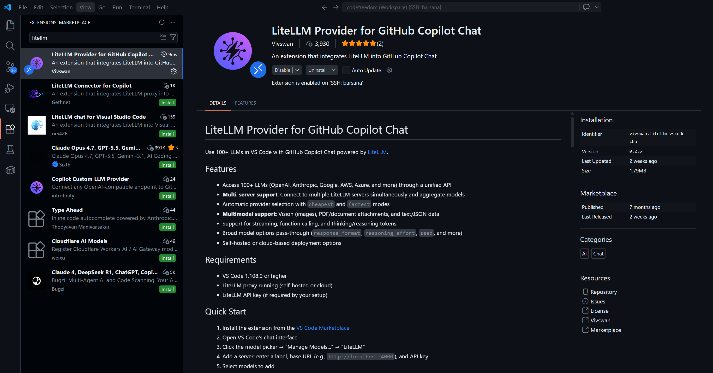
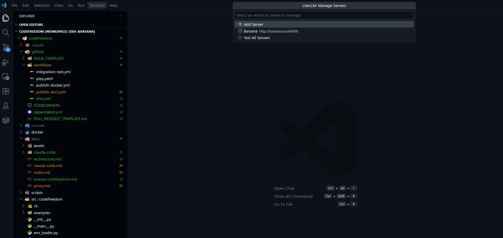
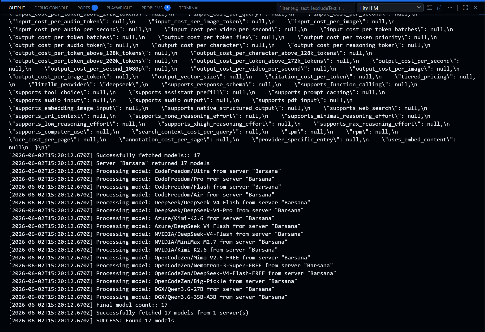
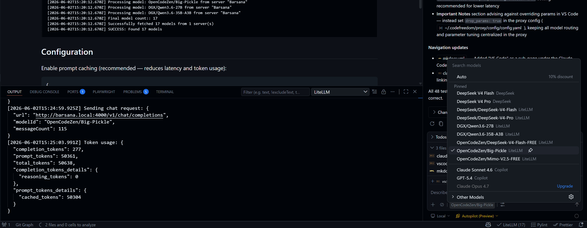

# VS Code

Use CodeFreedom's proxy as your OpenAI-compatible endpoint inside VS Code.

> **Third-party notice.** This page describes integration with a third-party
> extension **"LiteLLM Provider for GitHub Copilot Chat"** by **Vivswan**
> ([marketplace](https://marketplace.visualstudio.com/items?itemName=vivswan.litellm-vscode-chat),
> [GitHub](https://github.com/Vivswan/litellm-vscode-chat)).
> CodeFreedom is not affiliated with, endorsed by, or responsible for this
> extension. Each user is responsible for evaluating its suitability for their
> own use.

## 1. Install the Extension

Search for **"LiteLLM Provider for GitHub Copilot Chat"** by **Vivswan** in the VS Code extensions marketplace, or install directly:

- [marketplace.visualstudio.com/items?itemName=vivswan.litellm-vscode-chat](https://marketplace.visualstudio.com/items?itemName=vivswan.litellm-vscode-chat)
- [GitHub repository](https://github.com/Vivswan/litellm-vscode-chat)



## 2. Add the Proxy as a Server

In VS Code settings (`Ctrl+,` or `Cmd+,`), search for **`litellm-vscode-chat`** and set the server URL to your proxy endpoint:

| Setting                   | Value                     |
| ------------------------- | ------------------------- |
| `litellm-vscode-chat.url` | `http://localhost:4000`   |
| `litellm-vscode-chat.key` | Your `LITELLM_MASTER_KEY` |



## 3. Test the Connection

Open the VS Code chat panel and pick **"LiteLLM"** as the provider. You should see the models from your proxy listed — pick one and start chatting.



## 4. All Models Available

Once configured, every model from your proxy appears in the VS Code model picker. Switch between DeepSeek, Claude (via proxy), local models, or any other provider — all in one place.



## Configuration

Enable prompt caching (recommended — reduces latency and token usage):

```json
{
  "litellm-vscode-chat.promptCaching.enabled": true
}
```

## Important Notes

- **Do not override parameters in VS Code.** Configure `drop_params` in your LiteLLM proxy
  (`~/.codefreedom/proxy/config/config.yaml`) instead:

  ```yaml
  general_settings:
    drop_params: true
  ```

  This lets the proxy safely ignore unsupported parameters rather than sending them to the upstream provider and causing errors.

- **Model routing.** All model selection, fallback, and parameter tuning happens in the
  [proxy config](proxy.md) — VS Code just points to the proxy URL.

- **Prompt caching.** The extension supports Anthropic-style prompt caching
  through the proxy. Enable it in your VS Code settings (see above), then
  configure caching in the proxy provider config.

- **Third-party responsibility.** CodeFreedom is not responsible for the
  behavior, security, or compatibility of any third-party extension, including
  the LiteLLM Provider for GitHub Copilot Chat. Users should review the
  extension's source code, permissions, and privacy policy before installing.
