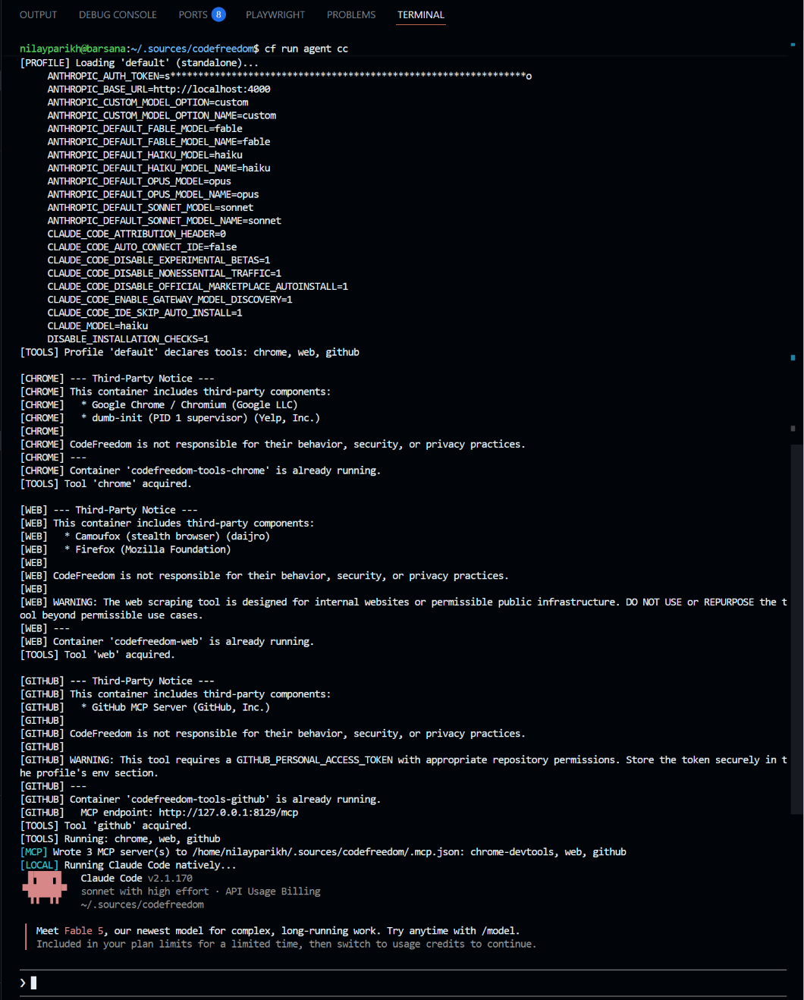

```
nilayparikh@barsana:~/.sources/codefreedom$ uv tool install codefreedom
Resolved 25 packages in 391ms
Prepared 6 packages in 173ms
Installed 25 packages in 5ms
 + annotated-types==0.7.0E
 + anyio==4.13.0
 + cachebox==5.2.3
 + certifi==2026.5.20
 + charset-normalizer==3.4.7
 + codefreedom==0.2.0
 + deepdiff==9.1.0
 + docker==7.1.0
 + gitdb==4.0.12
 + gitpython==3.1.50
 + h11==0.16.0
 + httpcore==1.0.9
 + httpx==0.28.1
 + idna==3.18
 + orderly-set==5.5.0
 + pydantic==2.13.4
 + pydantic-core==2.46.4
 + python-dotenv==1.2.2
 + pyyaml==6.0.3
 + requests==2.34.2
 + smmap==5.0.3
 + types-pyyaml==6.0.12.20260518
 + typing-extensions==4.15.0
 + typing-inspection==0.4.2
 + urllib3==2.7.0
Installed 2 executables: cf, codefreedom
nilayparikh@barsana:~/.sources/codefreedom$ cf -v
codefreedom 0.2.0
  python     3.12.3
  platform   Linux-6.17.0-1021-nvidia-aarch64-with-glibc2.39
  PyYAML           6.0.3
  deepdiff         9.1.0
  pydantic         2.13.4
  GitPython        3.1.50
  python-dotenv    1.2.2
  httpx            0.28.1
  docker           7.1.0
  docker server   29.2.1
```

```
cf setup init --plan-and-apply costeffective-coding-with-local

or

cf s i -pa  costeffective-coding-with-local
```

```
nilayparikh@barsana:~/.sources/codefreedom$ cf setup init --plan-and-apply costeffective-coding-with-local
  [STORE] Cloning https://github.com/nilayparikh/codefreedom-recipes.git -> /home/nilayparikh/.codefreedom/stores/nilayparikh-codefreedom-recipes-main (branch: main)
[PLAN] Recipe: costeffective-coding-with-local (extends _default)
[PLAN] Plan ID: EQUEC3qiXR
[PLAN] Files:   /home/nilayparikh/.codefreedom/plans/EQUEC3qiXR/
[PLAN]
[PLAN]   0 new files
[PLAN]   15 files to replace
[PLAN]   7 unchanged (skipped)
[PLAN]
[PLAN]            SOURCE       DESTINATION
[PLAN]   -------- ------------ ---------------------------------------------------------------------------
[PLAN]   REPLACE  costeffectiv /home/nilayparikh/.codefreedom/.env.claude.secrets
[PLAN]   REPLACE  costeffectiv /home/nilayparikh/.codefreedom/.env.proxy.secrets
[PLAN]   REPLACE  costeffectiv /home/nilayparikh/.codefreedom/.env.mimo.secrets
[PLAN]   REPLACE  _default     /home/nilayparikh/.codefreedom/profiles/chrome.yaml
[PLAN]   REPLACE  costeffectiv /home/nilayparikh/.codefreedom/profiles/mimo-code.yaml
[PLAN]   REPLACE  costeffectiv /home/nilayparikh/.codefreedom/profiles/open-code.yaml
[PLAN]   REPLACE  _default     /home/nilayparikh/.codefreedom/profiles/web.yaml
[PLAN]   REPLACE  _default     /home/nilayparikh/.codefreedom/profiles/github.yaml
[PLAN]   REPLACE  _default     /home/nilayparikh/.codefreedom/profiles/web-bridge.yaml
[PLAN]   REPLACE  costeffectiv /home/nilayparikh/.codefreedom/proxy/docker-compose.yaml
[PLAN]   REPLACE  costeffectiv /home/nilayparikh/.codefreedom/proxy/config/config.yaml
[PLAN]   REPLACE  costeffectiv /home/nilayparikh/.codefreedom/proxy/config/plugins/reasoning-efforts/reasoning-efforts-mapping.yaml
[PLAN]   SAME     _default     /home/nilayparikh/.codefreedom/scripts/_default/setup-secrets.sh
[PLAN]   SAME     _default     /home/nilayparikh/.codefreedom/scripts/_default/setup-secrets.ps1
[PLAN]   REPLACE  costeffectiv /home/nilayparikh/.codefreedom/.env.opencode.secrets
[PLAN]   REPLACE  costeffectiv /home/nilayparikh/.codefreedom/profiles/claude-code.yaml
[PLAN]   REPLACE  costeffectiv /home/nilayparikh/.codefreedom/proxy/config/providers/azure-foundry.yaml
[PLAN]   SAME     costeffectiv /home/nilayparikh/.codefreedom/proxy/config/providers/opencode.yaml
[PLAN]   SAME     costeffectiv /home/nilayparikh/.codefreedom/proxy/config/providers/openrouter.yaml
[PLAN]   SAME     costeffectiv /home/nilayparikh/.codefreedom/proxy/config/providers/local.yaml
[PLAN]   SAME     costeffectiv /home/nilayparikh/.codefreedom/scripts/costeffective-coding-with-local/setup-secrets.sh
[PLAN]   SAME     costeffectiv /home/nilayparikh/.codefreedom/scripts/costeffective-coding-with-local/setup-secrets.ps1
[PLAN]
[PLAN] To apply:  cf s i -a EQUEC3qiXR
[PLAN] Quick:     cf s i -pa costeffective-coding-with-local
[PLAN] To review: cat /home/nilayparikh/.codefreedom/plans/EQUEC3qiXR/<patch-file>.diff

[RECIPE] Apply this plan? [y/N] y
  [STORE] Cloning https://github.com/nilayparikh/codefreedom-recipes.git -> /home/nilayparikh/.codefreedom/stores/nilayparikh-codefreedom-recipes-main (branch: main)
[RECIPE] Installing base recipe '_default' first...
  [SAME]  .env.claude.secrets
  [SAME]  .env.proxy.secrets
  [SAME]  .env.mimo.secrets
  [SKIP]  profiles/chrome.yaml (auto-merge safe)
  [MERGE] profiles/mimo-code.yaml
  [MERGE] profiles/open-code.yaml
  [SKIP]  profiles/web.yaml (auto-merge safe)
  [SKIP]  profiles/github.yaml (auto-merge safe)
  [SKIP]  profiles/web-bridge.yaml (auto-merge safe)
  [MERGE] proxy/docker-compose.yaml
  [MERGE] proxy/config/config.yaml
  [MERGE] proxy/config/plugins/reasoning-efforts/reasoning-efforts-mapping.yaml
  [RECIPE] scripts/_default/setup-secrets.sh
  [RECIPE] scripts/_default/setup-secrets.ps1

  Recipe applied — 7 file(s) created/updated.
  [SAME]  .env.claude.secrets
  [SAME]  .env.proxy.secrets
  [SAME]  .env.mimo.secrets
  [SAME]  .env.opencode.secrets
  [SKIP]  profiles/claude-code.yaml (auto-merge safe)
  [MERGE] profiles/mimo-code.yaml
  [SKIP]  profiles/open-code.yaml (auto-merge safe)
  [MERGE] proxy/docker-compose.yaml
  [MERGE] proxy/config/config.yaml
  [MERGE] proxy/config/plugins/reasoning-efforts/reasoning-efforts-mapping.yaml
  [SKIP]  proxy/config/providers/azure-foundry.yaml (auto-merge safe)
  [SKIP]  proxy/config/providers/opencode.yaml (auto-merge safe)
  [SKIP]  proxy/config/providers/openrouter.yaml (auto-merge safe)
  [SKIP]  proxy/config/providers/local.yaml (auto-merge safe)
  [RECIPE] scripts/costeffective-coding-with-local/setup-secrets.sh
  [RECIPE] scripts/costeffective-coding-with-local/setup-secrets.ps1

  Recipe applied — 6 file(s) created/updated.

  No orphaned files to clean up.

  Recipe: costeffective-coding-with-local
  Cloud + local inference — DeepSeek, Azure, OpenCode, OpenRouter, and local backends via LiteLLM proxy
  -------------------------------------------------------
  [INFO]  Instructions written to /home/nilayparikh/.codefreedom/RECIPE.md

  Secrets:
  [SET]   LITELLM_MASTER_KEY  (CF_CLI_* override)
  [SET]   MICROSOFT_FOUNDRY_API_KEY  (CF_CLI_* override)
  [SET]   OPENCODE_ZEN_API_KEY  (CF_CLI_* override)
  [SET]   OPENROUTER_API_KEY  (CF_CLI_* override)
  [SET]   GITHUB_PERSONAL_ACCESS_TOKEN  (CF_CLI_* override)
  [MISSING] LOCAL_M_API_KEY  —  Local model key (primary)
           Any non-empty value — local server does not validate
  [MISSING] LOCAL_S_API_KEY  —  Local model key (secondary)
           Any non-empty value — local server does not validate

  Tip: as machine env var use CF_CLI_<NAME> (e.g. CF_CLI_LITELLM_MASTER_KEY),
       or use the bare name in a .env.*.secrets file.
       Machine env vars take priority over secrets files.

  Configuration (set in ~/.codefreedom/.env.user):
  [SET]   MICROSOFT_FOUNDRY_API_BASE  (.env.user)

  For interactive secret setup (recommended), run the assisted script:
    Bash:       bash /home/nilayparikh/.codefreedom/scripts/costeffective-coding-with-local/setup-secrets.sh
    PowerShell: /home/nilayparikh/.codefreedom\scripts\costeffective-coding-with-local\setup-secrets.ps1
  The script sets CF_CLI_* machine environment variables, persists them
  in your shell profile, and reports which services are configured.

  2 secret(s) missing — set them before starting the proxy.
```

# Setup Secret using assistance

```
nilayparikh@barsana:~/.sources/codefreedom$ sudo chmod +x /home/nilayparikh/.codefreedom/scripts/costeffective-coding-with-local/setup-secrets.sh
[sudo] password for nilayparikh:
nilayparikh@barsana:~/.sources/codefreedom$ /home/nilayparikh/.codefreedom/scripts/costeffective-coding-with-local/setup-secrets.sh
```

Adds block in /home/nilayparikh/.bashrc

```
# >>> codefreedom:costeffective-coding-with-local secrets >>>
# Added by: scripts/setup-secrets.sh (2026-06-14 21:38)
export CF_CLI_LITELLM_MASTER_KEY="sk-d......fro"
export CF_CLI_MICROSOFT_FOUNDRY_API_BASE="https://e......e.services.ai.azure.com/openai/v1"
export CF_CLI_MICROSOFT_FOUNDRY_API_KEY="9TwI......AL3"
export CF_CLI_OPENCODE_ZEN_API_KEY="sk-kD......37"
export CF_CLI_OPENROUTER_API_KEY="sk-or-v1-7c.....e1"
export CF_CLI_GITHUB_PERSONAL_ACCESS_TOKEN="github_pat_......5k1"
export CF_CLI_LOCAL_M_API_KEY="du......ey"
export CF_CLI_LOCAL_S_API_KEY="du......ey"
# <<< codefreedom:costeffective-coding-with-local secrets <<<
```

Start the proxy

```
nilayparikh@barsana:~/.sources/codefreedom$ cf run proxy start
[PROXY] Starting LiteLLM via Docker Compose (/home/nilayparikh/.codefreedom/proxy/docker-compose.yaml)...
[TOOLS] Ensuring tools are running...

[CHROME] --- Third-Party Notice ---
[CHROME] This container includes third-party components:
[CHROME]   * Google Chrome / Chromium (Google LLC)
[CHROME]   * dumb-init (PID 1 supervisor) (Yelp, Inc.)
[CHROME]
[CHROME] CodeFreedom is not responsible for their behavior, security, or privacy practices.
[CHROME] ---
[CHROME]   CDP port: 9222  MCP port: 9223
[CHROME] Using data dir: /home/nilayparikh/.codefreedom/tools/chrome
[CHROME] Using cached image 'docker.io/nilayparikh/codefreedom:chrome-latest'.
[CHROME] Starting container 'codefreedom-tools-chrome'...
[CHROME] Container started.
   CDP debug URL: http://127.0.0.1:9222
   MCP endpoint:  http://127.0.0.1:9223/mcp
   DevTools:      devtools://devtools/bundled/inspector.html?ws=127.0.0.1:9222

[WEB] --- Third-Party Notice ---
[WEB] This container includes third-party components:
[WEB]   * Camoufox (stealth browser) (daijro)
[WEB]   * Firefox (Mozilla Foundation)
[WEB]
[WEB] CodeFreedom is not responsible for their behavior, security, or privacy practices.
[WEB]
[WEB] WARNING: The web scraping tool is designed for internal websites or permissible public infrastructure. DO NOT USE or REPURPOSE the tool beyond permissible use cases.
[WEB] ---
[WEB] Using data dir: /home/nilayparikh/.codefreedom/tools/web
[WEB] Using cached image 'docker.io/nilayparikh/codefreedom:web-latest'.
[WEB] Starting container 'codefreedom-web'...
[WEB] Container started.
[WEB] Container started.
[WEB] MCP endpoint: http://127.0.0.1:8420/mcp

[GITHUB] --- Third-Party Notice ---
[GITHUB] This container includes third-party components:
[GITHUB]   * GitHub MCP Server (GitHub, Inc.)
[GITHUB]
[GITHUB] CodeFreedom is not responsible for their behavior, security, or privacy practices.
[GITHUB]
[GITHUB] WARNING: This tool requires a GITHUB_PERSONAL_ACCESS_TOKEN with appropriate repository permissions. Store the token securely in the profile's env section.
[GITHUB] ---
[GITHUB]   HTTP MCP port: 8129
[GITHUB] Using data dir: /home/nilayparikh/.codefreedom/tools/github
[GITHUB] Using cached image 'docker.io/nilayparikh/codefreedom:github-latest'.
[GITHUB] Starting container 'codefreedom-tools-github'...
[GITHUB] Container started.
   MCP endpoint: http://127.0.0.1:8129/mcp
[WEB-BRIDGE] Using data dir: /home/nilayparikh/.codefreedom/tools/web-bridge
[WEB-BRIDGE] Using cached image 'docker.io/nilayparikh/codefreedom:web-bridge-latest'.
[WEB-BRIDGE] Starting container 'codefreedom-web-bridge'...
[WEB-BRIDGE] Container started.
[WEB-BRIDGE] Container started.
[WEB-BRIDGE] SearXNG endpoint: http://127.0.0.1:8500/search
[WEB-BRIDGE] Health: http://127.0.0.1:8500/healthz
[+] up 1/1
 ✔ Container litellm-codefreedom-coding Created                                                                                       0.0s
[PROXY] Proxy started at http://localhost:4000 (litellm-codefreedom-coding)
nilayparikh@barsana:~/.sources/codefreedom$
```


```
nilayparikh@barsana:~/.sources/codefreedom$ cf run agent -h
usage: codefreedom run agent [-h] {list,claude-code,mimo-code,open-code} ...

agents:
  {list,claude-code,mimo-code,open-code}
    list                     List available agents
    claude-code (cc)         Claude Code — Anthropic's coding agent
    mimo-code (mc)           MiMoCode — Xiaomi's coding agent with 0-click proxy config
    open-code (oc)           OpenCode — terminal-native AI coding agent with 0-click proxy config

examples:
  cf r ag cc                       Launch Claude Code
  cf r ag mc --sandbox             Launch MiMo in sandbox
  cf r ag list                     List available agents
nilayparikh@barsana:~/.sources/codefreedom$ cf run agent cc
[ENV] Loading configuration...
  [ENV] Loaded claude secrets from /home/nilayparikh/.codefreedom/.env.claude.secrets
  [ENV] Loaded user overrides from /home/nilayparikh/.codefreedom/.env.user
[PROFILE] Loading 'default' (standalone)...
     ANTHROPIC_AUTH_TOKEN=s****************************************************************o
     ANTHROPIC_BASE_URL=http://localhost:4000
     ANTHROPIC_CUSTOM_MODEL_OPTION=custom
     ANTHROPIC_CUSTOM_MODEL_OPTION_NAME=custom
     ANTHROPIC_DEFAULT_FABLE_MODEL=fable
     ANTHROPIC_DEFAULT_FABLE_MODEL_NAME=fable
     ANTHROPIC_DEFAULT_HAIKU_MODEL=haiku
     ANTHROPIC_DEFAULT_HAIKU_MODEL_NAME=haiku
     ANTHROPIC_DEFAULT_OPUS_MODEL=opus
     ANTHROPIC_DEFAULT_OPUS_MODEL_NAME=opus
     ANTHROPIC_DEFAULT_SONNET_MODEL=sonnet
     ANTHROPIC_DEFAULT_SONNET_MODEL_NAME=sonnet
     CLAUDE_CODE_ATTRIBUTION_HEADER=0
     CLAUDE_CODE_AUTO_CONNECT_IDE=false
     CLAUDE_CODE_DISABLE_EXPERIMENTAL_BETAS=1
     CLAUDE_CODE_DISABLE_NONESSENTIAL_TRAFFIC=1
     CLAUDE_CODE_DISABLE_OFFICIAL_MARKETPLACE_AUTOINSTALL=1
     CLAUDE_CODE_ENABLE_GATEWAY_MODEL_DISCOVERY=1
     CLAUDE_CODE_IDE_SKIP_AUTO_INSTALL=1
     CLAUDE_MODEL=haiku
     DISABLE_INSTALLATION_CHECKS=1
[TOOLS] Profile 'default' declares tools: chrome, web, github

[CHROME] --- Third-Party Notice ---
[CHROME] This container includes third-party components:
[CHROME]   * Google Chrome / Chromium (Google LLC)
[CHROME]   * dumb-init (PID 1 supervisor) (Yelp, Inc.)
[CHROME]
[CHROME] CodeFreedom is not responsible for their behavior, security, or privacy practices.
[CHROME] ---
[CHROME] Container 'codefreedom-tools-chrome' is already running.
[TOOLS] Tool 'chrome' acquired.

[WEB] --- Third-Party Notice ---
[WEB] This container includes third-party components:


 ▐▛███▜▌   Claude Code v2.1.170
▝▜█████▛▘  sonnet with high effort · API Usage Billing
  ▘▘ ▝▝    ~/.sources/codefreedom

 ▎ Meet Fable 5, our newest model for complex, long-running work. Try anytime with /model.
 ▎ Included in your plan limits for a limited time, then switch to usage credits to continue.

──────────────────────────────────────────────────────────────────────────────────────────────────────────────────────────────────────────
❯  
──────────────────────────────────────────────────────────────────────────────────────────────────────────────────────────────────────────
  ? for shortcuts · ← for agents

```


